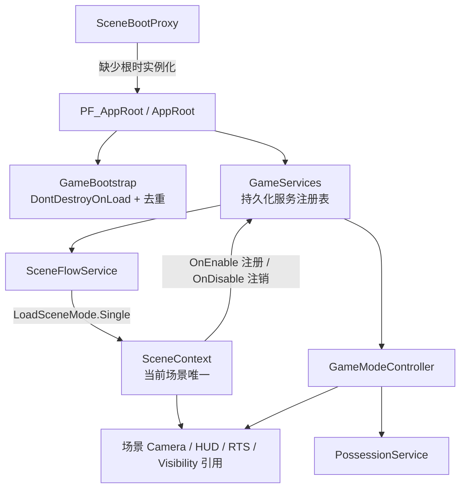
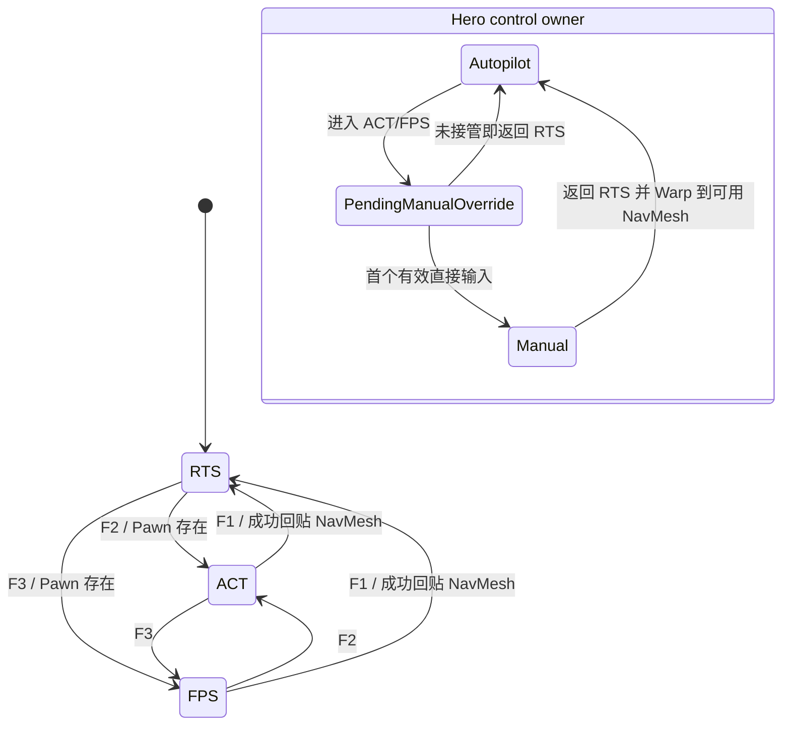
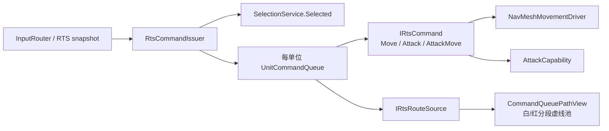

# OriginCore 架构与交接说明

- Unity：2022.3.62f3
- Render Pipeline：URP 14.0.12
- 基线构建：Windows x86_64 / Mono / Development Build
- 文档状态：P17 后持续维护版（2026-07-15）

## 1. 阅读顺序与需求优先级

接手开发前按以下顺序阅读：

1. 本文：系统边界、所有权、数据流、扩展入口、资产来源与运行手册。
2. [ImplementationStatus.md](ImplementationStatus.md)：P00～P17 的实现记录、验证证据和推迟项。
3. [TestMatrix.md](TestMatrix.md)：自动化测试、`90_SystemTest` 连续手工路径、Profiler 与 Player 构建验收结果。
4. [RequirementsAddendum.md](RequirementsAddendum.md)：用户在阶段验收中追加或覆盖的需求。
5. `DesignDocs/OriginCore_Codex_Implementation_Guide_Unity_2022.3.62f3.docx`：原始实施指导。

需求冲突时，优先级为：用户最新明确要求 > `RequirementsAddendum.md` > 实施指导文档。`DesignDocs/目前设计整理.docx` 与 `DesignDocs/设计文档.docx` 是设计来源，不直接覆盖上述实施规则。

本轮交付的是可扩展 Gameplay foundation，不是正式内容包。`Assets/_OriginCore` 与旧项目的 `Assets/Scripts`、旧场景和正式内容隔离；新 Runtime 程序集不能反向依赖 `Assembly-CSharp`。

## 2. 工程边界

### 2.1 程序集

| 程序集 | 位置 | 职责 |
|---|---|---|
| `OriginCore.Runtime` | `Assets/_OriginCore/OriginCore.Runtime.asmdef` | Player 可用的 Gameplay、UI、场景和持久化代码 |
| `OriginCore.Tests.EditMode` | `Assets/_OriginCore/Tests/EditMode` | 纯逻辑、序列化、Prefab/Scene/Build contract |
| `OriginCore.Tests.PlayMode` | `Assets/_OriginCore/Tests/PlayMode` | 生命周期、输入、模式、场景、存档与集成回归 |

Runtime 的显式包依赖只有 Cinemachine、AI Navigation、Input System、URP/Core RP、TextMesh Pro 和 UGUI。历史 P16 构建已确认 Player 中存在 `OriginCore.Runtime.dll`，不存在两个测试程序集。

P01～P16 的 `Tools/OriginCore` Apply、Validate 与 Build 自动化已经退役，`OriginCore.Editor` 程序集也已删除。后续需求直接修改 Runtime、场景、Prefab 与配置资产并同步文档，不再维护阶段生成器；默认验收只包含程序集编译和 Unity Console Error/Warning 清洁检查，其他测试仅按用户明确要求执行。

### 2.2 Build Settings 与场景职责

Build Settings 必须且只能按以下顺序启用三个场景：

| 索引 | 场景 | 职责 |
|---:|---|---|
| 0 | `Scenes/00_Bootstrap.unity` | 创建唯一持久化 `PF_AppRoot`，随后加载主菜单；不放 Gameplay Camera |
| 1 | `Scenes/01_MainMenu.unity` | 菜单、Options、存档入口和场景路由 |
| 2 | `Scenes/90_SystemTest.unity` | 全部 foundation 功能的可复现灰盒验收场 |

场景不能直接保存一份持久化 `AppRoot`。每个可直接播放的场景只保留一个 `SceneBootProxy`；若当前没有根，它实例化 `PF_AppRoot`。因此从 Bootstrap、MainMenu 或 SystemTest 直接 Play 都应得到且只得到一个 AppRoot。

## 3. 所有权与生命周期

### 3.1 `AppRoot` 与 `GameServices`

- `GameBootstrap` 最早执行、调用 `DontDestroyOnLoad` 并拒绝重复根。
- `AppRoot` 是唯一公开入口；`AppRoot.TryGetInstance` 用于场景对象绑定持久化服务。
- `GameServices` 明确持有 SceneFlow、Input、Settings、Mode、Possession、Resources、Pause、Save 等服务，不使用按类型搜索的全局容器。
- 初始化与 Shutdown 成对执行；事件订阅必须在相同所有者的关闭路径中解除。
- 持久化服务不能保存已卸载场景对象；唯一例外是当前 `SceneContext` 引用，注销时必须清空。

### 3.2 `SceneContext`

`SceneContext` 是场景侧 composition root，当前只允许一个。它集中暴露：

- Main Camera、三模式 Cinemachine Camera、HUD；
- Default Pawn 和模式 Camera target；
- RTS Camera、Selection、CommandIssuer 与相关 View；
- `MinimapMapDefinition`、`MinimapBounds`、`VisibilityBounds` 和 `VisibilitySystem`；
- Spawn anchors。

`SceneContext.OnEnable` 向 `GameServices` 注册，后者绑定 `GameModeController` 和 `PossessionService`；`OnDisable` 反向解绑。新增场景功能应先成为 SceneContext 的显式引用，不能在每帧用 `FindObjectOfType` 补线。

## 4. 输入、模式与 Hero 双驱动

### 4.1 单一输入管线

`Input/IA_OriginCore.inputactions` 是唯一输入资产。`InputRouter` 持有 Global、RTS、ACT、FPS、UI Action Map，把当前帧输入整理为不可变 `InputSnapshot`，再发布 `SnapshotReady`。Gameplay map 同时只能有一个；暂停、菜单、重绑定和存读档通过 `GameplayEnabled` 与抑制帧阻断旧输入穿透。

F1/F2/F3 不是各控制器自行监听，而是 Global map 请求 RTS/ACT/FPS。`GameModeController` 是唯一模式权威，它按事务顺序处理：

1. 验证目标模式与 Default Pawn；
2. 切换 InputRouter Gameplay map；
3. 更新 Possession 状态；
4. 同步 Camera priority、HUD 和 Cursor；
5. 最后发布一次 `ModeChanged`。

若任一步失败，模式不部分切换。无 Pawn 时 ACT/FPS 请求被安全拒绝并保留 RTS。

### 4.2 状态机

进入 ACT/FPS 时 Hero 不会立即停止 RTS 命令。`PossessionService.PrepareDirectObservation` 只把 `HybridControlDriver` 从 `Autopilot` 置为 `PendingManualOverride`；Look 或延续按住状态不算接管。首次 Move/Jump/Crouch/Aim 等有效输入在同帧触发一次 `AutopilotCancellationRequested`，清空 Hero 命令队列，再进入 `Manual`。之后同一输入不会重复取消。

### 4.3 双驱动不变量

- `Autopilot` / `PendingManualOverride`：启用 `NavMeshAgent`，禁用 `CharacterController`。
- `Manual`：禁用 `NavMeshAgent`，启用 `CharacterController`。
- `HybridPawnMotor` 是 `_OriginCore` 内唯一调用 `CharacterController.Move` 的类；ACT/FPS 控制器只能向它提交速度、跳跃和姿态。
- 返回 RTS 时先在当前位置附近采样 NavMesh，再启用 Agent 并 Warp；失败则保留手动模式和原位置，不制造位置跳变。
- ACT 使用 `MovementConfig`；FPS 使用独立 `FpsMovementConfig`。二者不得把数值硬编码回输入或 Prefab 脚本。
- FPS 疾跑遵守 `RQ-FPS-001`：按下只发起加速，松开达到 `sprintLatchMinSpeed` 才锁存，重复按下不关闭，完全停止后清除。
- 当前灰盒表现遵守 `RQ-PRES-001`：角色根保持权威位置与碰撞，单一球体 `VisualRoot` 由 `MovementBobPresentation` 在移动时只做本地 Y 浮动；`AttackEffectPresentation` 只消费现有攻击事件并生成阵营色光束/命中脉冲，不参与伤害判定；选择圈、血条、相机 Target 和命令路线不随视觉表现移动。

## 5. RTS 数据流

### 5.1 注册、选择与可见性

`EntityIdentity` 提供稳定 runtime id、archetype id、`UnitDefinition` 和 Role；`EntityRegistry` 是活动实体集合。`FactionRelationService` 统一决定 Friendly/Hostile/Neutral。`SelectionService` 只把对观察方可指挥、存活且可见的单位加入 command selection；敌对单位只进入 inspect 状态。

点击、Shift 追加、框选、Shift+1 空闲 Worker、Shift+2 Combat/Hero 都走 `InputRouter.SnapshotReady`。UI 和 Command targeting 会显式抑制 pointer selection，避免一次左键同时点击按钮、选单位并释放命令。

### 5.2 命令队列

`UnitCommandQueue` 有一个 current command 和最多 5 个 waiting command：

- 非 Shift：先 `StopAll`，再立即 Begin 新命令；
- Shift：无 current 时立即 Begin，否则追加；第 6 个 waiting 被拒绝；
- command 到达 Completed/Failed/Cancelled 后恰好推进一次；
- Hero 切入 Manual、单位 Disable/死亡、Stop 或读档都会清空瞬态队列。

新增命令实现 `IRtsCommand`；只有移动/攻击类命令实现 `IRtsCommandRoutePointProvider` 并声明 `RtsRouteStyle`。Move 为 `Standard` 白线，Attack/AttackMove 为 `Attack` 红线，技能使用 `None` 或不实现该接口。`UnitCommandQueue.TryBuildStyledRoute` 按“当前位置 → current → waiting”构建带样式分段，`CommandQueuePathView` 复用 List、LineRenderer 池、共享材质和运行时 32×1 虚线纹理，不为技能另建或误生成路线。

### 5.3 指针语义（用户覆盖需求）

本节以 `RQ-RTS-001`、`RQ-RTS-002`、`RQ-RTS-003` 为最终规则，覆盖指导文档中的旧鼠标释放和路线定义：

- Move、Attack、AttackMove 和 Set Rally 的 targeting 由后续左键松开确认；进入 targeting 的 UI 点击不能立即释放。
- targeting 中右键不确认；退出依靠明确取消或模式切换。
- 非 targeting 时，右键可达地面对移动单位发布默认 Move。
- 当前选择含生产建筑时，非 targeting 右键直接更新所选建筑 Rally，不进入队列；Set Rally 按钮仍使用左键释放。
- 单位命令和建筑 Rally 都通过统一 `IRtsRouteSource` 表现：Move/Rally 白色，Attack/AttackMove 红色，技能无路线。

### 5.4 Combat、资源与生产

- `VitalsComponent` 是 Health/Shield/Energy 唯一状态源；`DamageReceiver` 先扣 Shield，再扣 Health，并保证死亡只发布一次。
- `AttackCapability` 从 `UnitDefinition` 读取 range/damage/cooldown/vision，统一敌对验证、平面距离、可选 LOS、朝向和 `DamageInfo`；成功后发布 `AttackPerformed`。
- `AutoTargetScanner` 使用固定缓冲和低频扫描；`AttackMoveCommand` 临时交战后继续原路线。炮台由 `TurretAutoAttackController` 在建筑 Operational 且攻击 capability 启用时驱动相同扫描/攻击链，不拥有移动命令队列。
- Crystal Resource Node 以 Neutral + Building role 表示静态采集建筑，并明确不装配选择、移动或命令队列组件。
- `ResourceService`/`ResourceWallet` 原子处理 Commander Resource、Crystal、Influence used/cap。
- `ProductionQueue` 最多 5 个订单，入队时一次性扣普通资源并预留 Influence；暂停依赖 `Time.deltaTime == 0` 冻结；取消/建筑死亡只退款一次。
- `UnitSpawner` 只生成配置的 Worker/Combat archetype；除 `Awake` 缓存外，实际解析 archetype 时还会按需补绑 `ContentCatalogService`，避免 Gameplay Scene 直启时受 `SceneBootProxy` / `AppRoot` 初始化顺序影响。生成成功后 `RallyPointController` 通过普通 `MoveCommand` 派发，不绕过命令管线。
- Rally 路线继续复用统一虚线 Overlay；落点标记使用独立 `MAT_RallyMarkerOverlay`，以 Overlay queue、关闭深度写入并始终通过深度测试，避免被地形遮挡。

## 6. UI、暂停与设置

`ModeHudPresenter` 只呈现 `GameModeController.CurrentMode` 对应的 RTS/ACT/FPS 根；FPS Crosshair 也只在 FPS 显示。`DirectControlHudView` 监听 `PossessionService.PawnChanged` 与当前 Pawn 的 `VitalsChanged`，目前武器状态明确显示 `NOT CONFIGURED`。

RTS HUD 使用零边距贴边布局。`P08_CommandPanel` 固定在右下角并采用 360×360 的 4×4 指令网格。`RtsCommandPanelView` 根据 Selection capability 组合面板：只有存在完整 `UnitCommandQueue` 时显示 Move；仅选中建筑或矿物资源点时隐藏 Move，但保留空槽且不把生产/研究/建设等动态指令向前补位；其余动态槽继续承载能力、部署、晋升和武器交易。View 同时负责暗色底板、完整描边、阴影、分类强调色、顶部高光及禁用态，不把表现状态写回 Gameplay。面板内部不再承担目标提示、队列摘要或反馈文本；生产面板独立贴在它的正上方。

`RtsCameraController` 在地图启动时确定性选择友方主基地（生产/出生与资源回收建筑优先）并直接设置 Camera Rig 的 XZ。首个默认指针采样只建立基准，发生真实位置变化后才允许边缘平移，避免 `(0,0)` 默认值在加载阶段把镜头推离基地。

主菜单、Pause、Options、Save UI 使用 Page/Modal 栈。Esc 优先关闭最上层 Modal/Page，全部关闭后才切换 Pause。`PauseService` 统一管理 `Time.timeScale`、Gameplay 输入和 Cursor override；任何子 UI 不应各自写 `timeScale`。

`SettingsService` 是运行时设置权威；`SettingsRepository` 写入 `Application.persistentDataPath/OriginCore/settings.json`。写入采用 UTF-8 无 BOM 的 `.tmp` + replace/move，异常时清理临时文件并保留旧文件。输入重绑定 override JSON 也通过设置数据持久化。

## 7. 存档流程

### 7.1 格式与文件安全

- 目录：`Application.persistentDataPath/OriginCore/Saves`。
- 当前 schema：`SaveGameData.CurrentSchemaVersion == 1`。
- slot id 与 display name 分离，文件名只使用安全 slot id。
- 写入：序列化 UTF-8 JSON → `.tmp` → 已有文件用 `File.Replace` 和短暂 `.bak`，新文件用 move；失败保留旧档。
- 读取：坏 JSON、未知 schema、文件名/slot id 不一致和未知场景都返回可解释失败，不部分恢复。
- JsonUtility 会忽略未知字段，P16 已覆盖向前兼容断言。

### 7.2 Capture / Restore 顺序

`SaveService` 禁用 Gameplay 输入后创建 `SaveOperationContext`，依次 Capture 所有 `ISaveParticipant`。Load 时先退出暂停、切回 RTS、异步加载 catalog scene，等待新 `SceneContext` 注册，再按 `RestoreOrder` 执行：

| 顺序 | Participant | 内容 |
|---:|---|---|
| 100 | entities | 静态/运行时实体、稳定 id、archetype、阵营、Transform、Vitals、Influence；清选择和命令 |
| 150 | rally-points | 建筑 Rally |
| 200 | resources | 三资源快照 |
| 250 | visibility | Explored cell；Visible 由当前 emitter 重算 |
| 300 | game-mode | 最后恢复模式和呈现 |

新增持久化域应实现 `ISaveParticipant`，给出不冲突的 `ParticipantKey` 和明确 `RestoreOrder`，并在 `SaveService.RegisterDefaultParticipants` 注册。Capture/Restore 必须容忍缺失或未知内容，通过 `context.Warn` 跳过单项；不能让一个未知 archetype 破坏整个档。

不会保存的瞬态状态包括：Selection/Inspect、当前和等待命令、targeting、Pause 层级、运行时 Ghost、当前 Visible cells、相机 blend 中间态和输入按住状态。

## 8. Visibility、Fog 与 Minimap

`VisibilitySystem` 根据 `VisibilityBounds` 和 `VisibilityConfig.cellSize` 创建 XZ 网格。默认按配置的 5 Hz 更新：

1. 所有 `Visible` 降为 `Explored`；
2. Friendly `VisionEmitter` 把圆形范围标为 `Visible`；
3. `VisibilityTarget` 根据观察方和格子状态隐藏/恢复 Renderer、World Canvas、Selectable 与 selection collider；
4. Building 在可见时记录最后位置，离开视野后只在 Explored 区保留静态 memory marker；重新照亮旧位置时刷新或清除错误记忆；
5. 复用 `Color32[]` 更新运行时 fog texture；小地图 UI 直接引用它，主视图黑色遮罩通过全局 Shader 参数提交给 `VolumetricFogRendererFeature`（保留旧类型名以兼容已序列化 Renderer Data）。

三个 URP quality renderer 在后处理前读取 Main Camera Depth，重建当前表面的世界坐标并在 `MapDefinition.WorldBounds` 内采样一次三态纹理。Hidden/Explored 输出纯黑，Visible 输出透明；天空和 bounds 外直接透明。这里没有体积光线积分、空间噪声或相机相关的密度累计，因而遮罩和地表坐标保持一致。

地图加载绑定时，`MapDefinition.WorldBounds` 同时重建 Visibility 网格并配置场景根的 `WorldBoundaryWalls`。四个无 Renderer、非 Trigger 的 BoxCollider 以内侧面对齐 XZ 边界且覆盖足够飞行高度，阻止单位离开玩法范围；系统测试直启回退到场景 Visibility collider。该对象仅为运行时边界，不保存到存档。

小地图不包含 Camera、RenderTexture 或世界平面。`MinimapMapDefinition` 提供每张地图独立的手绘纹理，或在没有正式美术时一次性生成静态网格底图；Camera 位置、旋转、缩放和 CullingMask 均不参与像素生成。`MinimapView` 直接叠加运行时 fog texture，并根据 `EntityRegistry`、Faction、Role、Visibility 与世界坐标创建 UI 标记。Building memory 只读取最后已知位置。`MinimapBounds` 负责 UI 归一化坐标与世界 XZ 的双向映射；左键仅在 RTS 调用 `RtsCameraController.CenterOnWorldPosition`，因此相机是点击结果而不是小地图数据源。Fog 网格和 Minimap 使用同一世界 bounds 语义。

当前逻辑揭示使用 XZ 网格和分地图高度/遮挡求解；黑色 Shader 只消费求解结果，不参与判定。

## 9. 扩展指南

### 9.1 新角色或替换 Hero

1. 新建/复制 `UnitDefinition`，为 `archetypeId`、Role、Vitals、移动与 combat 数值给出稳定配置。
2. 保留 Prefab 根的 `EntityIdentity`、`FactionMember`、`VitalsComponent`、`Selectable` 和 `VisionEmitter`；正式模型放在纯视觉子节点，不能把 runtime id 放到模型子节点。
3. 灰盒阶段保持一个球体 `VisualRoot`、一个 `MovementBobPresentation` 和一个 `AttackEffectPresentation`；拥有正式 WeaponAction 集的 Hero Y 额外挂 `WeaponSkillVfxPresentation`，以 39 个稳定 Action ID 选择专属程序化轨迹，并覆盖该角色的通用 WeaponAction 光束。正式模型接入时可以替换视觉子节点及表现组件，但浮动、特效或 Animator 都不得写 Prefab 根的权威 Transform 或驱动伤害判定。
4. 可 RTS 移动角色保留 `NavMeshAgent`、`NavMeshMovementDriver` 和 `UnitCommandQueue`。
5. 可直接控制角色额外保留 `CharacterController`、`HybridControlDriver`、`HybridPawnMotor`、ACT/FPS Controller；两个驱动永远不能同时启用。
6. 在目标场景把该对象赋给 `SceneContext.DefaultPawn`，并设置 ACT/FPS Camera follow/look target。
7. ACT 参数放入 `MovementConfig`，FPS 参数放入 `FpsMovementConfig`；不要修改 InputRouter 来保存角色数值。
8. HUD Vitals 已通过当前 Possession target 自动绑定；新增角色状态应提供事件驱动数据源，扩展 `DirectControlHudView`，不要每帧查找 Pawn。
9. 若角色可运行时生成，扩展 `UnitSpawner` archetype restore 映射并验证稳定 runtime id 与存档恢复。

### 9.2 武器/技能（不要创建总控 `Weapon` 类）

正式武器系统仍未实现。接入时使用可组合 capability/state，而不是新增一个持有输入、瞄准、伤害、动画、库存和 UI 的巨型 `Weapon` 类：

- ADS/FOV 继续使用 `FPS.AimState`；它只负责可逆的 Camera lens 状态。
- 伤害统一进入 `DamageInfo`/`DamageReceiver`/`VitalsComponent`；通用攻击距离和命中反馈可复用 `AttackCapability.AttackPerformed`、`HitFlash` 与 HealthBar 数据。
- ACT 已预留 `Primary`、`WeaponPrevious`、`WeaponNext`、`WeaponWheel`；FPS 已预留 `Primary`、`Slot1..3`、`Grenade`，都已进入 `InputSnapshot`，当前只是 observation-only。
- 新功能只在对应 active map、Gameplay 未 suppressed 且当前 Possession 为 Manual 时消费输入。
- 世界目标技能沿用 `RtsCommandIssuer` targeting 左键释放规则；可排队技能实现 `IRtsCommand`，但路线样式保持 `None`，不接入 Move/Attack 指示线。
- 弹药、装备、投射物、购买和动画反馈各自使用独立组件/数据定义，并为存档新增 participant；不要塞进 `GameModeController` 或 `InputRouter`。

### 9.3 新地图

1. 复制 SystemTest 的基础设施 contract，不复制 AppRoot；场景根保留唯一 `SceneBootProxy`、`SceneContext`、EventSystem、Main Camera、AudioListener。
2. 把场景加入 Build Settings 和 `SO_SceneCatalog`，使用稳定 scene key；需要出现在菜单时再添加 MapSelect 数据。
3. 设置 `SceneContext` 的 Default Pawn、三模式 Camera target、HUD、RTS 服务和 Spawn anchors。
4. 使用 `NavMeshSurface` 定义可走区域并 Bake；确认 Hero 返回 RTS 的采样范围和生产 SpawnPoint 周围有可达 NavMesh。
5. 创建地图专属 `MinimapMapDefinition`，并让 `MapDefinition.WorldBounds` 覆盖完整玩法范围；SceneContext 和 MinimapView 引用同一地图定义，场景不得创建小地图 Camera、RenderTexture 或 FogOverlayPlane；确认当前 URP Renderer Data 含兼容命名的 `VolumetricFogRendererFeature`。Visibility 与四面空气墙会在地图绑定时使用同一 WorldBounds 自动配置。
6. 静态可保存实体必须有唯一预制 runtime id；运行时生成实体必须有可恢复 archetype。
7. 等待 Unity 编译完成并确认 Console 无 Error/Warning；只有用户明确要求时，才按 `TestMatrix.md` 运行 EditMode/PlayMode 或场景直启、三模式、Pause、Save/Load、Minimap 和 Visibility 手工链路。

### 9.4 新 RTS 命令或生产项

- 命令：实现 `IRtsCommand`，所有 Begin/Tick/Cancel 都要幂等处理 terminal 状态；通过 `RtsCommandIssuer` 下发。
- 路线：实现统一 route point 接口，不创建第二套 LineRenderer 管理器。
- 生产：新增 `ProductionRecipe`、Prefab/archetype restore 映射和资源/Influence 事务；失败路径不得扣款或泄漏 reservation。
- UI：监听现有事件并在 Disable 时解绑；不要用 per-frame LINQ、反射或场景搜索刷新列表。

## 10. 占位资产、来源与许可边界

### 10.1 当前清单

| 类别 | 当前来源 | 替换说明 |
|---|---|---|
| 单位、建筑、地面、障碍 | Unity Primitive mesh，已直接序列化在 Prefab/Scene 中 | 保留 Prefab 根和碰撞/Gameplay 组件，只替换视觉子节点 |
| `MAT_*.mat` | 项目内创建的 URP 占位材质，无外部贴图 | 正式材质放入有来源记录的新目录 |
| `SH_CommandQueueOverlay.shader`、`SH_VolumetricFog.shader` | 本项目为 foundation 编写 | 可替换表现，不改变 route/grid 数据 contract；Fog 主视图按表面世界坐标采样黑色遮罩，小地图直接使用同一三态 UI 遮罩 |
| `SO_SystemTestMinimapMap.asset` | 项目内 `MinimapMapDefinition` 数据；当前使用一次性生成的 256×256 网格与八个静态地图区域 | 正式地图可改为引用单独绘制的纹理，不改变标记、迷雾与点击映射 contract |
| `Art/UI/Legacy/Commands`、`Abilities` | 从现有工程 `Assets/Resources` 复制，见同目录 `LegacyUiAssetManifest.md` | 新副本使用独立 GUID；只有已有 Move/Attack/Stop 接入场景，能力图标保持未引用 |
| UI 字体 | `_OriginCore/Resources/Fonts/F_NotoSansSC_SDF` 动态 TMP 字体 | 已从项目旧 Noto 文件迁移；发布前仍需补齐字体来源/许可记录 |
| Audio | 只有项目内 `AM_Main.mixer`，没有 AudioClip | 后续音频必须随附来源/许可清单 |
| 位图/AI 生成图 | 无 | 当前 `_OriginCore` 不含 png/jpg/psd/tga 等生成图 |

序列化 GUID 反查曾确认 `_OriginCore` 只跨目录依赖 TextMesh Pro 默认字体；当前 UI 字体已经复制到 `_OriginCore` 并通过 Resources 动态加载，不再依赖旧目录 GUID。其余外部组件来自 manifest 中的 Unity 官方包。AudioMixer 中未解析的 32 位值是 mixer exposed-parameter id，不是资源 GUID。

项目旧目录中的 `Assets/Resources/Fonts/NotoSansSC-VF.ttf` 已复制为 `_OriginCore/Art/UI/Fonts/F_NotoSansSC_VF.ttf` 并生成动态 TMP 资产；源文件许可仍未在项目内确认，发布前必须补齐来源/许可记录。旧 `QuickOutline` 和旧行为脚本没有进入 `_OriginCore` 序列化依赖；旧地图几何、Gun/Sword 视觉与部分图标只按 [TechnicalDesign.md](TechnicalDesign.md) 的迁移边界复用或复制，仍需发布许可确认。MCP for Unity 是单独声明的 Editor 工具包，`package.json` 提供 `licensesUrl`，不属于 Player 内容。

### 10.2 正式资产替换规则

1. 每批第三方或生成资源在同目录放 `LICENSE`/`NOTICE`/来源清单，记录作者、来源 URL、许可、修改方式和导入日期。
2. 不覆盖 Gameplay Prefab 根；模型、Animator、VFX 和音频作为可替换子对象或引用接入。
3. 中文 TMP Font Asset 已创建且字体文件位于 `_OriginCore`；正式发布前补齐 Noto 来源/许可文件，必要时替换为许可已确认的等价 CJK 字体并保持 Resources 路径稳定。
4. 正式替换后直接保存 Prefab/Scene，并完成程序集编译与 Console Error/Warning 清洁检查；旧阶段 Apply/Validate 不再存在，也不会覆盖手工内容。
5. 新资产进入 Player 前按需重做跨目录 GUID、Missing Script/Reference 与 Player 构建审计。

## 11. `90_SystemTest` 复现手册

### 11.1 启动与基础按键

1. Unity 打开后等待编译完成，并确认 Console 没有项目 Error/Warning。
2. 可从 `00_Bootstrap` 验证完整启动，也可直接打开 `90_SystemTest` Play；两种方式都只能有一个 AppRoot。
3. F1/F2/F3 切 RTS/ACT/FPS，Esc 按 UI 层级关闭或暂停。
4. RTS：左键选择/框选，右键默认移动，A 进入 Attack targeting，S Stop，Shift 追加；Shift+1/Shift+2 快捷选择。
5. ACT：WASD、Mouse Look、Space、Left Ctrl；按住 Left Shift 锁定最近可见敌人，Q/E 循环武器，按住 Tab 使用武器轮盘，5 对准 Crystal Node 召唤 Worker。
6. FPS：WASD、Mouse Look、Space、Left Ctrl、Left Shift 疾跑、右键 ADS、左键主动作、1/2/3 切装备槽、Tab 武器轮盘；短按 4 循环投掷物，长按 4 打开投掷物轮盘，5 召唤 Worker。正式投掷物内容尚未提供，因此默认 Hero 列表为空。

### 11.2 核心验收链路

在一次连续 Play 中依次完成：RTS 选择 → Move/Shift 队列与白色虚线 → Stop → Attack/AttackMove → 建筑右键/按钮 Rally 与生产 → Hero 长距离命令 → F2 观察自动移动 → 首次 WASD 接管 → ACT 移动能力 → F3 FPS 疾跑/滑铲/ADS → F1 回 RTS → Pause/Options → Save 后改变状态再 Load → Minimap 点击 → 敌人隐藏与 Building Ghost → 重复模式/暂停/读档/场景往返三轮。

每一步的精确期望和历史实测结果见 `TestMatrix.md` 第 3～5 节。后续默认不重复这些旧阶段验收；只有用户明确要求时，才运行受影响的 EditMode、PlayMode 或连续手工路径。

### 11.3 构建

项目不再提供自定义构建菜单。需要构建时，保存场景并退出 Play，通过 Unity 标准 Build Settings 或受控命令行构建 Windows x86_64 Development Player；建议输出仍为 `Builds/Windows64Development/OriginCore.exe`。历史已验证输出为 300 个文件、122,625,346 bytes，Console 0 Error / 0 Warning；Player 主路径、退出、设置和存档持久化均已通过。

## 12. 指导文档到实现的映射

| 阶段 | 指导目标 | 当前落点 | 状态 |
|---|---|---|---|
| P00 | 基线与冲突审计 | `ImplementationStatus.md` P00 | Done |
| P01 | 目录、程序集、包、层、Build Settings | Foundation setup + ProjectSettings | Done |
| P02 | AppRoot、SceneContext、场景流 | Core / SceneFlow | Done |
| P03 | 可运行灰盒测试场 | Placeholder Prefab + `90_SystemTest` | Done |
| P04 | 单一 Input System 管线 | IA_OriginCore + InputRouter/Rebind | Done |
| P05 | Entity/Faction/Vitals | Gameplay / Combat foundation | Done |
| P06 | RTS/ACT/FPS 与 Possession | GameMode、Camera、Hybrid driver | Done |
| P07 | RTS Camera 与 Selection | RTS selection + HUD | Done |
| P08 | Move/Stop/Queue | Command pipeline + dashed route | Done；按 RQ-RTS-001/002 覆盖 |
| P09 | 通用 combat/AttackMove | Combat capability + commands | Done |
| P10 | 资源、生产、Rally | Economy / Buildings / Spawner | Done；按 RQ-RTS-003 覆盖 |
| P11 | ACT movement | ACT controller + MovementConfig | Done |
| P12 | FPS movement | FPS controller + AimState | Done；按 RQ-FPS-001 覆盖 |
| P13 | Menu/Pause/Settings/HUD | UI / Settings / PauseService | Done |
| P14 | Save/Load | schema v2 + v1→v2 migration + participant pipeline | Done |
| P15 | Minimap/Visibility | shared grid + fog + memory | Done |
| P16 | 集成、性能与 Windows build | 历史 Run All、Profiler、Player 证据 | Done；阶段工具已退役 |
| P17 | 架构、状态、矩阵与交接 | 本文 + 两份最终状态文档 | Done |

P00～P17 表只记录 2026-07-15 的 foundation 历史。此后已经直接在 Runtime/资产中完成 ContentCatalog、MatchSession、Y/Z 内容、三把武器运行时、建设/科技/晋升/采集、schema v2、黑色战争迷雾、独立小地图、运行时空气墙和旧地图迁移；现行边界与实现默认值以 [TechnicalDesign.md](TechnicalDesign.md) 为准。原始设计为空的正式地图任务/Boss、正式武器技能和最终平衡数据没有被虚构。

## 13. 已知限制与接手检查表

- Y/Z Gameplay 和三把武器运行时已接入，但角色正式模型/动画、最终 VFX/Audio 仍未提供。
- Gun/Revolver/Sword 可操作且有 HUD；专属武器技能按需求保持空数组，经济与弹药值仍是可配置默认值。
- ACT 目标锁定、ACT/FPS 武器轮盘和投掷物运行时已接通；原设计未提供正式投掷物内容，因此 Hero 的投掷物定义列表当前为空。
- Visibility 的权威数据仍是低频 XZ 网格并带分地图高度/遮挡求解；世界表现由 URP 黑色遮罩 Renderer Feature 消费该网格。
- Save schema 为 v2，包含 v1→v2 migration；正式 Mission 内容为空，因此尚无 Mission participant。
- 只验收 Windows x86_64 Mono Development Build；IL2CPP、其他平台和 Release 性能未声明通过。
- 当前 UI 仍有英文占位文案；中文字体已纳入 `_OriginCore`，但源文件许可记录仍待发布前补齐。
- Unity MCP 在 Editor domain reload 时可能输出工具包 WebSocket 重连警告；它不进入 Player，项目 Runtime/Player 最终日志为干净状态。

接手一次修改前后应确认：

- 没有第二个 AppRoot、SceneContext、EventSystem、AudioListener 或 Main Camera；
- 没有同时启用 NavMeshAgent 与 CharacterController；
- 没有绕过 InputRouter、GameModeController、CommandQueue、DamageReceiver 或 Save participant 管线；
- 所有订阅在 Disable/Shutdown 解除，稳态没有每帧分配；
- 新资源有来源与许可记录；
- Unity 程序集编译完成且 Console 无项目 Error/Warning；按用户明确要求补充受影响的自动化、手工路径或目标 Player 构建。

## 全局 UI 主题层

`OriginCoreUiTheme` 是持久化、纯表现的 Runtime 服务，在场景载入前创建并保证单例。它遍历已加载 Canvas，为屏幕空间的 Panel、Button、Toggle、Slider、Dropdown、Scrollbar、ScrollRect 和 TMP 文本应用浅蓝白晶体与青蓝/紫色能量强调的统一样式，并以低频重扫覆盖运行时生成的设置绑定行、弹窗和动态页面。

主题层不拥有页面状态、不处理输入，也不改写 RectTransform 布局。血量/护盾 Fill、准星、小地图、迷雾、选择框、图标与标记通过语义名称和 Sprite 规则排除；`RtsCommandPanelView` 的所有后代继续由命令面板自己的类别颜色负责。世界空间 Canvas 仅统一生命条背景和框线。

### 像素、字体与指令信息流

- `OriginCoreUiTheme` 为所有 Screen Space Canvas 强制启用 `pixelPerfect`，并用四个不可射线命中的内部 `Image` 绘制边框。边框完全位于父 RectTransform 内，不会因窗口裁剪或 Canvas 缩放丢失外侧线条。
- `Resources/Fonts/F_NotoSansSC_SDF` 是运行时统一 TMP 字体入口，采用 Dynamic Atlas；主题扫描和指令面板动态创建文本都会显式绑定该资产。
- `RtsCommandPanelView` 只把短标题写入 4×4 槽位，把完整描述保存为槽位展示数据。`RtsCommandInfoRelay` 将 Pointer Enter/Exit 和 Select/Deselect 转交给 `SelectionSummaryView`。
- `SelectionSummaryView` 现为无输入所有权的 `INFORMATION` 呈现器：默认消费 `SelectionService` 的当前实体数据，临时消费指令详情；Selection 变化会取消临时详情并恢复实体信息。
- `SelectionService.PreviewScreenRect` 先收集框内全部可指挥对象，再以“存在单位则排除建筑”的规则生成唯一预览集合；`CommitPreview` 直接提交该集合，保证类别互斥与预览/提交一致。
