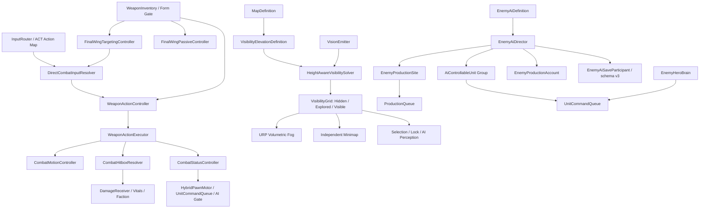
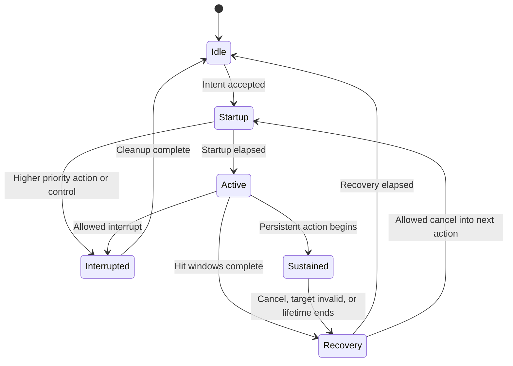
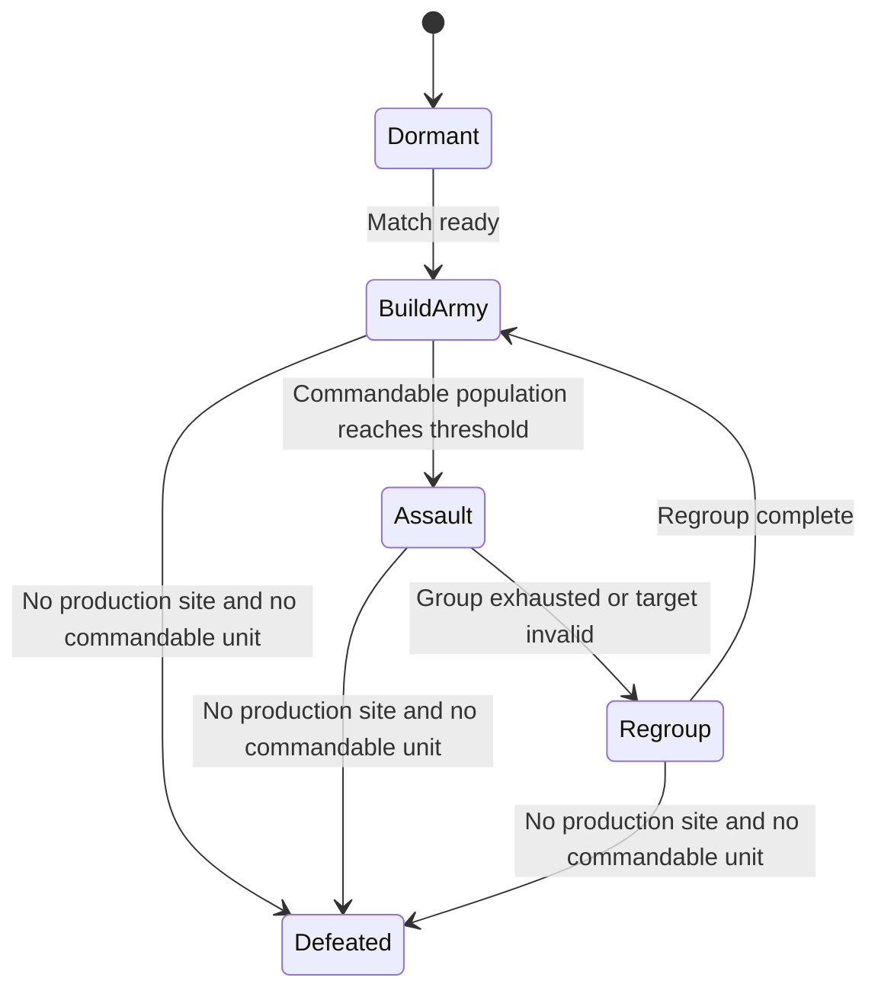

# OriginCore 更新设计实现技术设计

- 文档状态：Runtime/Data As-Built（Unity 导入、Catalog、Prefab 与场景静态验收已完成；逐动作手感、AI 实战与正式表现资源仍待人工验收/内容输入）
- 编制日期：2026-08-18
- 设计文档更新时间：2026-08-17 21:48（本地文件时间）
- 来源核对：以当前 DOCX 结构化内容为准；`DesignDocs/qa` 的 4 页 PNG 仍是 2026-06-11 旧版渲染
- 需求来源：[设计文档.docx](../../../DesignDocs/设计文档.docx)
- 更新前 As-Built 基线：[TechnicalDesign.md](TechnicalDesign.md)
- 需求覆盖规则：[RequirementsAddendum.md](RequirementsAddendum.md)
- 目标 Unity：2022.3.62f3 / URP 14.0.12
- 当前内容版本：`origin-core-dev-7`
- 当前存档版本：schema v3

> 本文同时记录目标架构、当前落地状态和剩余实施路线。标记为“底座已实现”的能力只代表
> 对应 Runtime/数据契约已经存在；未完成正式资产或 Unity Editor 运行验收的能力，
> 不得对外宣称为完整玩法。实施只修改 Runtime、场景、Prefab、ScriptableObject 和正式资源；
> 不恢复 `Tools/OriginCore` 阶段菜单、Apply/Validate 生成器或其他永久 Editor 自动化。

## 1. 目标与范围

2026-08-17 更新后的设计文档补全了三个此前缺失的内容域：

1. Y 英雄的三套正式武器与完整动作规则；
2. 地图高低地对 RTS 视野的影响；
3. 不扩张、依托预置生产建筑集结兵力并进攻玩家基地的敌方 AI。

本方案的目标是在不破坏现有启动、三模式、RTS 命令、经济生产、黑色战争迷雾、独立小地图和
Save/Load 的前提下，将以上内容转化为可配置、可保存、可扩展的正式 Runtime 架构。

本技术设计不擅自补齐：

- 未给出设计的武器购买/返还价格、最终动作时长、动画、VFX、音频和发布许可；
- 敌方英雄的具体技能决策树；
- 正式关卡任务、剧情、Boss 行为和最终平衡；
- 任何已落地需求的反向改动；
- 未在更新设计中定义的敌方经济参数、进攻阈值和正式关卡目标。

### 1.1 状态口径

| 状态 | 含义 |
|---|---|
| 已落地 | Runtime、数据和必要 Prefab/Map 引用已经存在，仍需按维护规则做 Unity 编译/Console 验证 |
| 已落地未接线 | 通用 Runtime 已存在，但正式 Scene/Prefab/Definition 尚未装配，当前局内不会产生完整行为 |
| 原型数据 | 规则可运行，但仍由代码默认值或占位资产提供，不能作为最终平衡和正式内容 |
| 待内容输入 | 模型、动画、VFX、音频、图标、精确数值或许可未提供，Runtime 只保留接入点 |

### 1.2 最新设计更新摘要

与此前现行技术设计相比，`设计文档.docx` 的有效增量集中在三组需求：

1. Y 的时隙之钥、时序之键、终焉之翼，包括普通连段、组合输入、位移/控制、辅助武器、
   被动和跨武器持续动作；
2. 地图通过高低差保留传统 RTS 高地视野；
3. 敌方 AI 只依赖预置建筑和单位，不扩张，持续生产普通单位，达到阈值后进攻玩家基地，
   敌方英雄继续使用独立 AI。

旧文档已经确认的 HUD、左键释放指令、路线颜色、建筑右键集结、黑色战争迷雾、独立小地图、
RTS 相机直接平移、FPS 疾跑锁存等规则不因本次更新回退。

## 2. 需求优先级与冲突处理

发生冲突时按以下顺序解释：

1. 用户后续明确确认的需求；
2. `RequirementsAddendum.md`；
3. 2026-08-17 更新的 `设计文档.docx`；
4. 当前 As-Built 技术文档与代码；
5. 旧指导文档和旧项目行为，仅作为参考。

| 主题 | 更新设计中的描述 | 本方案采用的规则 |
|---|---|---|
| RTS 待确认指令 | 部分章节仍描述右键释放 | Move、Attack、技能和 Set Rally 均按 RQ-RTS-001 使用后续左键释放；非待确认时右键保留语境指令 |
| RTS Camera | 允许调整倾角或带转向表现 | 固定 60°，边缘移动只做直接平移，小地图点击即时定位，不产生转向或阻尼 |
| FPS Sprint | 常规按住疾跑 | 使用已确认的锁存语义；达到最低疾跑速度后松键不减速，真正停止后清除 |
| 战争迷雾 | 白色雾气、旧平面或体积方案 | 三态数据不变，世界按表面世界坐标使用 bounds 内的纯黑遮罩，小地图复用同一纹理；地图外透明，WorldBounds 同时生成四面空气墙 |
| 小地图 | 可能从相机画面获得 | 必须由地图定义独立绘制，Camera 不能成为底图、迷雾或标记的数据源 |
| HUD | 原始布局与提示 | 继续采用零边距贴边、一行资源、正方形小地图、底部选择栏、右下 4×4 指令面板及图形化 Vitals；不恢复模式/按键常驻提示 |
| 命令路线 | 未区分完整语义 | Move 白色、Attack/AttackMove 红色、技能无路线，建筑右键直接设置白色集结路线 |
| 验证方式 | 旧阶段菜单和 Validator | 不恢复 Tools；默认只做程序集编译与 Console Error/Warning 检查，Test Runner、Play Mode、Profiler 和 Build 仅在用户明确要求时执行 |

## 3. 更新差异、当前落地与缺口

| 能力域 | 当前落地状态 | 已有实现 | 剩余缺口 |
|---|---|---|---|
| 武器动作数据 | 已资产化、数值待定 | 三个 `WeaponActionSetDefinition` 资产完整保存 17/16/6 个动作，三把 WeaponDefinition 显式引用；Catalog 要求正式 Y 武器必须有序列化 ActionSet；运行时构造 fallback 已移除；Unity AssetDatabase 已真实加载并通过三个 ActionSet 与总 Catalog 校验 | 动作时间、范围、倍率和表现仍是待手感/平衡确认的原型值 |
| ACT 输入与动作 | 已落地 | `DirectCombatInputResolver`、`WeaponActionController`、`WeaponActionExecutor`；支持组合键、短长按、锁定、地空分支、动作中断、外部能力仲裁与一次消费；离开 ACT 时统一清理动作/连段；39 个动作已由 `WeaponSkillVfxPresentation` 穷举映射程序化特效 | 需在 Unity 中逐动作手感与视觉验收；正式动画不得成为伤害权威 |
| 战斗控制 | 已落地 | `CombatHitboxResolver`、`CombatStatusController`、`CombatMotionController`；支持 Push/Pull/Launch/GroundSlam/TemporalLock 与清理 | Boss/建筑/友军的控制免疫与叠加规则未定义；正式阻挡层和落点参数需按地图调优 |
| 终焉之翼 | 规则与程序化特效已接线 | ACT 辅助槽、`FinalWingPassiveController`、`FinalWingTargetingController`、`FinalWingPresentationController`、逐次主武器命中队列、移速/飞行倍率、受伤减免、持续技能被动抑制；HeroY 创建六片无碰撞原型羽翼，并由 `WeaponSkillVfxPresentation` 显示六翼往返、持续齐射、背向爆发、挑起、六边形对角斩与反向双环终结；显式锁定优先，否则按武器射程选择最近可见敌人 | 正式羽翼模型、贴图/Shader、对象池化高规格弹道及 FPS 边界仍需内容确认；持续技能和默认目标生命周期需逐动作人工验收 |
| 高低地可见性 | 已落地未完成正式数据 | `VisibilityElevationDefinition`、`HeightAwareVisibilitySolver`、`MapDefinition` 接线；SystemTest0 与 LegacyMap 已分别引用带 revision 的运行时几何采样资产；Unity 已确认两张地图的 SceneCatalog、Build Settings、Elevation 引用和 NavMesh 数据有效 | 当前仍是加载时采样而非烘焙数组；需人工观察高看低、低看高、悬崖边与遮挡物，再决定是否烘焙正式数据 |
| 敌方生产上下文 | 已落地 | `ProductionContext`、账户/解锁接口、`EnemyProductionAccount`；两张地图显式采用 `FreeRecipes`、独立 20 人口上限和 Combat 配方 | 免费生产符合“特殊建筑持续生产、无敌方采集经济”的当前规则；最终配方、人口上限和生产时长仍属平衡数据 |
| 敌方宏观 AI | 已落地待运行验收 | `EnemyAiDefinition`、确定性加权生产、EntityRegistry 单位集合、地图级 `EnemyAiMapSetup`、运行时 `EnemyAiSceneInstaller`、五态 Director 和存档恢复；生产在 BuildArmy/Assault/Regroup 持续运行，死亡站点不再生产，Assault 读档后重发一次命令；普通敌军与英雄隔离，`EnemyHeroBrain` 独立索敌并通过 AttackCommand 作战；两张地图的 Setup、资金策略、生产 Prefab、稳定 ID、友方建筑与 NavMesh 已通过 Unity 静态验收 | 需人工确认实际生产/集结/进攻和读档顺序；敌方英雄技能/撤退策略仍待设计 |
| Save/Load | 已落地 | schema v3、v1→v2→v3 migration、ACT 主/副武器、Enemy AI 阶段/生产 cursor/独立账户 participant，以及敌方生成单位账户恢复 | 需补齐内容 revision 的通用迁移策略，并用 Unity 实档验证 AI 账户、实体、队列和阶段恢复顺序 |
| 正式内容 | 待内容输入 | 稳定 ID、Prefab 接入点和逻辑占位路径已存在 | 三武器模型/动画/VFX/音频/图标、AI 正式兵种与基地布置、平衡数据和许可清单均未完成 |

## 4. 目标系统架构



### 4.1 架构原则

- 数据定义与运行状态分离：ScriptableObject 只保存稳定 ID、规则和资源引用，冷却、连段、
  当前阶段、锁定对象和持续效果属于运行实例。
- 输入只通过 `InputRouter` 进入玩法，不允许武器脚本直接读取 `Keyboard.current` 或
  `Mouse.current`。
- 动作时间线是规则权威；Animation Event 只对齐表现，不负责决定是否造成伤害。
- 伤害继续统一经过 Faction、DamageReceiver 和 Vitals，武器不得绕过现有死亡与回能链路。
- 位移继续由 `HybridPawnMotor` / CharacterController 执行，不直接写 Transform。
- AI 复用玩家单位的生产与命令管线，不建立第二套移动、伤害或资源系统。
- VisibilityGrid 继续是显隐唯一权威；高度算法只替换“如何标记 Visible”，不改变三态语义。

## 5. 内容 ID 与资产迁移

### 5.1 新正式武器

| 稳定 ID | 显示名 | 角色 | 解锁形态 | ACT 主手 |
|---|---|---|---|---|
| `weapon.y.timeslot-key` | 时隙之钥 | 近战剑、默认武器 | Base | 是 |
| `weapon.y.sequence-key` | 时序之键 | 近战镰刀、控制/输出 | Released | 是 |
| `weapon.y.final-wing` | 终焉之翼 | 远程永久辅助武器、终极武器 | Final | 否 |

实施约束：

- 保留现有 `weapon.gun`、`weapon.revolver`、`weapon.sword`，不得改名复用为新武器；
  这样旧存档和占位角色仍能解析原 ID。
- Hero Y 的三把专武全部默认必带：时隙之钥、时序之键、终焉之翼按顺序固定占用比赛配置 ACT 第 1～3 槽，均不可清空或替换；第 4 槽保留一个可配置武器。Released 和 Final 形态仍分别控制时序之键与终焉之翼何时生效。
- `HeroDefinition.RequiredActWeapons` 保存有序必带引用；MatchSetup 的前三槽各自只显示对应必带项，配置验证负责把旧存档或外部配置中的缺失、错位与重复项归一化，并按原顺序保留其余最多一个唯一武器。终焉之翼在 WeaponInventory 中仍进入独立 Auxiliary 槽。
- 终焉之翼由独立辅助槽持有。暂按“不占用四个 ACT 主手槽”设计，最终需由设计确认。
- 旧三把武器继续使用现有通用 `WeaponController`；三把新武器走动作系统。两条管线共享
  Inventory、轮盘、伤害、展示和存档契约。
- 每个动作使用稳定命名空间 ID。当前原型采用 `action.y.timeslot.*`、`action.y.sequence.*` 和
  `action.y.final-wing.*`；后续资产化不得改动这些已进入日志/引用的 ID，也不得依赖数组下标或
  显示名。

### 5.2 当前目录与目标资产化

```text
Assets/_OriginCore/
├── Data/Content/Weapons/
│   ├── SO_Weapon_Y_TimeslotKey.asset
│   ├── SO_Weapon_Y_SequenceKey.asset
│   ├── SO_Weapon_Y_FinalWing.asset
│   ├── SO_WeaponActionSet_Y_TimeslotKey.asset
│   ├── SO_WeaponActionSet_Y_SequenceKey.asset
│   └── SO_WeaponActionSet_Y_FinalWing.asset
├── Data/Content/
│   ├── SO_EnemyAI_Default.asset
│   ├── SO_EnemyAIMap_SystemTest0.asset
│   └── Maps/SO_EnemyAIMap_Legacy.asset
├── Data/Visibility/
│   ├── SO_VisibilityElevation_SystemTest0.asset
│   └── SO_VisibilityElevation_Legacy.asset
└── Scripts/Runtime/
    ├── Content/WeaponActionSetDefinition.cs
    ├── Content/BuiltInWeaponActionLibrary.cs   # 只保留三个既有稳定武器 ID 常量
    ├── Weapons/
    ├── Visibility/
    └── AI/
```

三个 ActionSet 已直接保存为可审阅的 Unity YAML ScriptableObject 资产，不建立永久 Editor
生成器。三个 `WeaponDefinition._actActionSet` 均显式引用对应资产；`WeaponDefinition` 不再调用
代码构造 fallback，Catalog 也会拒绝缺少显式 ActionSet 的正式 Y 武器。`BuiltInWeaponActionLibrary`
名称仅作为稳定 ID 的兼容表面保留，不再保存或创建动作定义。

## 6. 武器动作数据模型

### 6.1 定义对象

| 类型 | 责任 | 关键字段 |
|---|---|---|
| `WeaponActionSetDefinition` | 一把正式武器的 ACT 动作集合 | weaponId、normal combos、action list、input profile、priority profile |
| `WeaponComboDefinition` | 地面或空中普通攻击链 | orderedActionIds、resetDelay、loopDelay、airGravityPolicy |
| `WeaponActionDefinition` | 单个动作的规则 | id、input chord、conditions、phases、damage events、motion、statuses、cancel policy |
| `WeaponActionPhaseDefinition` | Startup/Active/Recovery 的阶段数据 | duration、priority、movement、hit windows、interrupt/cancel mask |
| `WeaponHitDefinition` | 一次或重复命中的规则 | shape、self/target/action-start center、repeat interval/count/until-phase-end、source/main/locked-target multiplier |
| `WeaponStatusDefinition` | 位移或控制效果 | type、magnitude、duration、resistance tag、stack policy |
| `WeaponActionDefinition` 的持续字段 | 跨武器持续动作 | persistentWhenUnequipped、maximumPersistentSeconds、cancelButtons、requiredMainWeaponId；`maximumPersistentSeconds = 0` 仅允许目标约束或显式取消可终止的动作 |

`WeaponDefinition` 新增以下引用，而不是继续扩张当前空的 `AbilityDefinition[]`：

```csharp
WeaponActionSetDefinition ActActionSet;
WeaponEquipRole EquipRole;       // MainHand / Auxiliary
string RequiredFormId;
bool PersistsWhenUnequipped;
```

`AbilityDefinition` 继续服务通用主动能力和 RTS 技能；武器动作的多阶段时间线、连段和输入语法
由专用定义负责，避免让通用能力对象承担互相冲突的职责。

### 6.2 运行状态机



`WeaponActionController` 每帧只处理当前动作实例：

- 在接收意图时冻结 Ground/Air、方向、锁定对象和装备上下文；
- 按阶段改变优先级、移动约束和可取消集合；
- Active 窗口触发逻辑命中，Recovery 完成后回到 Idle；
- 普通攻击在配置的重置时间内推进连段，超时从第一段开始；
- 高优先级动作只在定义允许时中断低优先级动作；
- 所有退出路径都执行统一 Cleanup，归还重力、碰撞层、位移锁和临时模型状态。

建议的可配置优先级层级是 `Normal < Skill < Finisher < ForcedControl`。具体动作可在阶段内
提高或降低优先级；数值本身是调参数据，不写死在控制器中。

## 7. ACT 输入语法

### 7.1 Input Action

现有 `Primary`、方向、锁定、Q/E、Tab 和 Transform 继续复用；新增或语义化以下动作：

| Action | 默认意图 | 说明 |
|---|---|---|
| `PrimaryAttack` | 左键 | 主武器普通攻击及组合招式 |
| `SecondaryAttack` | 右键 | 终焉之翼普通攻击；ACT 中不与 FPS ADS 共用语义 |
| `DirectDash` | 鼠标上侧键 | Y 已有通用冲刺；必须查询武器动作的中断规则，但不替代“前方向 + 攻击”招式 |
| `WeaponModifier` | 鼠标下侧键 | 武器技能修饰键 |
| `MoveVector` | WASD | 组合键方向快照，不要求角色已产生位移 |
| `TargetLock` | Shift | 使用现有 ACT 锁定规则 |

不得依赖 Input System 的“完全同时按下”。`DirectCombatInputResolver` 把按下事件写入短缓冲，
在可配置组合窗口内解析为不可变 `DirectCombatIntent`：

```text
Intent = InputChord
       + DirectionSnapshot
       + GroundedSnapshot
       + LockTargetSnapshot
       + PressDuration
       + Frame/Time
```

建议组合窗口初值为 0.12 秒，短/长按阈值初值为 0.25 秒；两者均为待手感验证的配置值，
不是最终平衡。多种候选同时成立时采用：

1. 三键终结技；
2. 锁定专属技能；
3. 方向 + WeaponModifier + 攻击；
4. 方向 + 攻击；
5. 单独 WeaponModifier；
6. 普通攻击。

同一个物理按下只能被一个意图消费一次。UI 抑制、Pause、模式切换和接管帧继续由
`InputRouter` 统一门控；不允许缓冲跨越离开 ACT、读档或 Pawn 切换。

`DirectDash` 继续承载 Y 已有的通用冲刺能力；时隙之钥技能 1、2、8、9 的“前方向 + 攻击”
仍严格按更新设计解析，不能偷换成 DirectDash 键。`DirectCombatInputResolver` 消费
Primary/Secondary/WeaponModifier；`DirectAbilityController` 在武器动作输入生效时屏蔽旧
Ability2，并在 Dash/角色能力执行前先用 `AbilityLoadout.CanCastSlot` 做无副作用预检，再调用
`WeaponActionController.TryAuthorizeExternalAction`。外部请求只有满足当前阶段的 cancel/interrupt
优先级时才会结束现有动作，避免无效施法或不可取消的 Recovery/Finisher 与 Dash 同帧并行。

Q/E、Tab 和 Transform 保持现有职责，并统一查询 `CanAuthorizeExternalAction`。Q/E 与轮盘切换
允许 Pawn 级持续动作继续存在；Transform 先通过 `HeroFormStateMachine.CanEnterNextForm` 预检，
再请求优先级 50 的动作中断，避免形态切换失败却丢失当前动作。一个物理按下仍只能由武器
Resolver 或 Ability Controller 中的一方消费，不能用多个并行订阅共同触发。

### 7.2 锁定与自动目标

- 时隙之钥和时序之键的“锁定版本”只在现有 TargetLock 仍有效时成立。
- 终焉之翼维护自己的默认攻击目标：锁定变化优先更新目标；无锁定时选择攻击范围内最近的
  可见存活敌人。
- 目标在死亡、超距、不可见或无效时立即清除；下一次 SecondaryAttack 可以重新搜索。
- 自动目标查询必须经过 VisibilityGrid 和 FactionRelations，不能借由物理查询泄露隐藏敌人。

以上规则现由 `FinalWingTargetingController` 实现。Resolver 为主手与辅助武器分别冻结 Intent：
主手只接收显式 TargetLock，辅助武器接收“显式锁定优先，否则默认目标”，因此终焉之翼的自动
索敌不会意外解锁时隙/时序的锁定专属动作。持续技能每次 tick 还会复核存活、射程和 Visibility；
任一条件失效即进入统一 `TargetInvalid` 清理路径。

## 8. 时隙之钥技术规格

基础伤害：50。主手近战剑，Base 形态默认武器。

### 8.1 普通攻击

| 动作 | 条件与运动 | 命中与伤害 | 连段规则 |
|---|---|---|---|
| 地面 1 | 小幅前突、斜斩 | 1 次 × 1.0 | 进入第 2 段 |
| 地面 2 | 小幅前突、反向斜斩 | 1 次 × 1.0 | 进入第 3 段 |
| 地面 3 | 穿过目标到背后，短暂停顿后返回 | 去程、回程各 1 次 × 1.0 | 同一目标按两个独立 Hit Event 结算 |
| 地面 4 | 强力斜斩 | 1 次 × 3.0 | 完成后结束连段 |
| 空中 1 | 斜斩，不前突 | 1 次 × 1.0 | 攻击期间暂停重力 |
| 空中 2 | 反向斜斩，不前突 | 1 次 × 1.0 | 攻击期间暂停重力 |
| 空中 3 | 逆时针旋转一周 | 总计 × 2.0 | 完成后 0.5 秒才允许重新从第 1 段开始 |

地面连段在 1 秒内未接下一段时重置。空中攻击结束、被中断、落地、离开 ACT 或 Pawn
失效时必须恢复重力。

### 8.2 专属动作

| # | 输入/条件 | 行为 | 伤害与控制 |
|---|---|---|---|
| 1 | Forward + PrimaryAttack | 向前冲刺，穿过单位碰撞 | 路径目标各 × 1.0 |
| 2 | 锁定 + Forward + PrimaryAttack | 朝锁定目标冲刺并推行路径敌人 | × 1.0 + Push |
| 3 | WeaponModifier + PrimaryAttack | 发出 45° 剑气 | × 1.0 + Interrupt |
| 4 | 锁定 + WeaponModifier + PrimaryAttack | 在目标上方开启裂隙并强力吸附 | 中心目标 × 1.5；被吸附目标 × 0.2 + Pull |
| 5 | 锁定 + Forward + WeaponModifier + PrimaryAttack | 瞬移至目标正面并小范围斩击 | × 2.0；0.5 秒不可取消 Recovery；空中保持悬停 |
| 6 | Back + PrimaryAttack 短按 | 将敌人挑空 | × 1.0 + Launch |
| 7 | Back + PrimaryAttack 长按 | 将敌人与自身带到相同高度 | × 1.0 + LaunchPair |
| 8 | 空中 Forward + PrimaryAttack | 比地面版本更远的穿行冲刺 | 路径目标各 × 1.0 |
| 9 | 空中锁定 + Forward + PrimaryAttack | 更远距离冲向目标并推行敌人 | × 1.0 + Push |
| 10 | 空中 Back + PrimaryAttack | 向下斩击并将附近目标压向下方 | × 1.0 + GroundSlam；施术者与主目标保持同高直至动作结束 |

“无碰撞冲刺”解释为忽略可指挥单位和敌方单位的动态碰撞，但仍尊重不可穿越的世界几何、
地图边界和落点安全检查；否则会破坏 NavMesh、场景边界和存档位置合法性。若设计要求穿墙，
必须另行明确。

地面普通第 3 段使用 `CrossThroughAndReturn` 运动类型：动作开始冻结原点与最多 3 米的穿越点，
去程结束短暂停顿后返回；重复命中窗口分别覆盖去程和回程。裂隙和正面瞬移斩使用目标中心
Hit 查询，裂隙用独立的锁定主目标倍率覆盖实现“中心 ×1.5、周边 ×0.2”。

## 9. 时序之键技术规格

基础伤害：200。Released 形态开放的近战镰刀，强调大范围控制和输出，不提供通用机动加成。

### 9.1 普通攻击

| 动作 | 行为 | 命中与伤害 |
|---|---|---|
| 地面 1 | 斜斩，不前突 | × 1.0 |
| 地面 2 | 反向斜斩，不前突 | × 1.0 |
| 地面 3 | 水平旋转两周 | 周围目标接受 2 次 × 1.0 |
| 地面 4 | 召唤幻影镰刀进行多方向斩击 | 设计写明 6 次攻击，每次 × 0.5；幻影数量存在原文歧义 |
| 空中 1 | 同地面第 1 段 | × 1.0 |
| 空中 2 | 同地面第 2 段 | × 1.0 |
| 空中 3 | 纵向旋转 | 命中次数与时间窗由 Action 定义配置 |
| 空中 4 | 向下砸击 | × 1.0 + GroundSlam |

### 9.2 专属动作

| # | 输入/条件 | 行为 | 伤害与控制 |
|---|---|---|---|
| 1 | WeaponModifier | 投出并收回镰刀 | 路径敌人被拉至身前，× 1.0；完成后可接普通第 3 段 |
| 2 | 锁定 + WeaponModifier | 朝锁定目标投掷并收回 | 拉回目标，× 1.0；完成后可接普通第 3 段 |
| 3 | WeaponModifier + PrimaryAttack | 投出持续旋转的镰刀，最长 10 秒 | 范围内目标每 0.5 秒 Interrupt + × 1.0；PrimaryAttack 或 WeaponModifier 召回；切换武器不终止 |
| 4 | Back + PrimaryAttack | 纵向旋转三周并将敌人带至统一高度 | 3 次、总计 × 3.0 |
| 5 | Back + WeaponModifier + PrimaryAttack | 跃起后大范围砸地 | × 3.0 |
| 6 | 空中 Left/Right + WeaponModifier + PrimaryAttack | 勾住敌人旋转一周 | × 1.0；允许被其他技能中断 |
| 7 | 空中 Forward + WeaponModifier + PrimaryAttack | 强力斩击并击退 | × 3.0 + Push |
| 8 | 空中 Back + PrimaryAttack | 将敌人砸向地面 | × 3.0 + GroundSlam |

动作 3 由 Pawn 根上的 `WeaponActionController` 持有，而不是当前武器模型 GameObject。
`persistentWhenUnequipped` 或 Weapon 的 `PersistsWhenUnequipped` 决定切换主手后是否继续；隐藏或
替换武器模型不能销毁动作实例。召回、超时、死亡、离开场景和读档都走同一幂等清理路径。
其命中中心在动作开始时冻结为前方投掷锚点，不随 Pawn 后续移动或主手切换漂移；动作 1/2
完成后写入普通连段索引 2，因此下一次 PrimaryAttack 从第 3 段继续。

## 10. 终焉之翼技术规格

基础伤害：20。Final 形态开放的永久辅助武器，不能成为主手。SecondaryAttack 默认为右键。

### 10.1 普通攻击与被动

普通攻击从左右上/中/下共六个方向发射羽翼，穿过目标后返回：

- 一轮共 6 次命中，每次 × 1.0；
- 单击至少完成一轮，命中间隔 0.1 秒；按住时在上一轮 Recovery 后自动开始下一轮；无显式锁定时必须先由可见敌人自动索敌解析到目标，否则不启动动作；
- 每次命中只作用于该次辅助武器意图冻结的目标，不对目标周围单位产生隐式范围伤害；
- 作为辅助武器时也能执行；
- `FinalWingPresentationController` 在 HeroY 下只创建一组六片无碰撞原型羽翼，装备且进入 Y 最终形态时显示，并用命中事件轮流脉冲；伤害仍完全由动作/Hitbox 管线结算。正式羽翼模型、离体/返回轨迹、逐片占用状态和弹道对象池属于后续表现资源工作包。

| 被动 | 规则 |
|---|---|
| 1 | 主武器每次有效命中自动触发连续 3 轮终焉之翼普通攻击；自动触发的羽翼伤害不能再次触发自身，防止递归 |
| 2 | 平面移动速度 +20%，通过 RuntimeStatModifier 注册并在失效时移除 |
| 3 | 受到伤害时由羽翼阻挡 50% 输入伤害；在 Armor 前后的结算顺序必须统一配置并记录 |
| 4 | 滑翔速度 +200%，只修改现有 Flight/Glide 参数，不直接写 Transform |

### 10.2 主动技能

| # | 输入/条件 | 行为 | 伤害与特殊规则 |
|---|---|---|---|
| 1 | WeaponModifier + SecondaryAttack | 释放全部羽翼持续攻击当前目标 | 每 0.2 秒 × 60.0，直到目标死亡或主动中断；切换主手不终止；PrimaryAttack 或 WeaponModifier 取消；期间四个被动全部禁用 |
| 2 | Back + WeaponModifier + SecondaryAttack | 转身并将全部羽翼释放到身后大范围 | × 50.0；达到最大距离后立即返回 |
| 3 | Back + SecondaryAttack | 部分羽翼从下方挑起目标 | × 30.0 + Launch |
| 4 | 时隙之钥主手 + WeaponModifier + PrimaryAttack + SecondaryAttack | 六片羽翼组成六边形并停止敌方时间；施术者消失，从六个顶点分别向对角顶点斩击，每个顶点 3 次，回归后追加剑斩 | 总伤害 = 50 × 主武器基础伤害 + 100 × 辅助武器基础伤害；结束后额外维持 5 秒 TemporalLock；冻结目标不可位移 |
| 5 | 时序之键主手 + WeaponModifier + PrimaryAttack + SecondaryAttack | 镰刀顺时针旋转并逐步放大加速，羽翼反向旋转，牵引范围敌人，共 10 周 | 每个目标总伤害 = 10 × 主武器基础伤害 + 100 × 辅助武器基础伤害；Finisher |

持续技能和终结技同样由 Pawn 级 Host 持有。技能 1 关闭被动时使用引用计数/令牌，而不是直接
把被动布尔值写死；无论取消、死亡、切换模式或销毁，都必须恰好恢复一次。
技能 1 的 Sustained phase 为零时长阶段，`repeatUntilPhaseEnds` 使命中调度以 0.2 秒间隔持续，
不再用“150 次/30 秒”近似设计；目标失活、PrimaryAttack、WeaponModifier 或更高优先级外部动作
进入同一结束路径。
两个终结技不再把合计伤害预先折算成辅助武器倍率：Hit 定义分别保存辅助武器与动作开始时
主手的倍率。时隙终结技为 `100 × Wing + 50 × Timeslot = 4500`；进入演出时先对六边形区域
施加 1.8 秒 TemporalLock，Recovery 一次结算最终伤害并覆盖为额外 5 秒锁定。时序终结技在
2.5 秒 Sustained 阶段执行 10 次零伤害 Pull 控制，结束时一次结算
`100 × Wing + 10 × Sequence = 4000`，避免 Armor、命中回能和受击触发被重复计算。主手在
持续期间切换也不会改变已冻结的伤害来源。

## 11. 命中、位移与控制效果

### 11.1 命中解析

`CombatHitboxResolver` 提供 Sphere、Capsule、Box、Arc、Sweep 和 ProjectilePath 查询：

- 使用 NonAlloc 物理查询和复用缓冲；
- 每个 Hit Event 维护目标去重集合，除非定义明确允许重复命中；
- 目标型 Hit 可声明 `OnlyIntentTarget`，自动索敌和显式锁定都只伤害冻结目标；
- 先验证存活、Faction、Visibility/Targetability，再发送 DamageRequest；
- DamageRequest 附带 weaponId、actionId、hitIndex、source mode 和 passive-trigger 标记；
- 只有实际改变 Shield/Health 的 Y 直控伤害继续触发 RQ-HEROY-001 的 1 Energy 回能。

### 11.2 状态执行器

新增 `CombatStatusController`，实现：

| 状态 | 作用 | 结束/免疫要求 |
|---|---|---|
| Interrupt | 中断允许被打断的当前动作 | 与动作阶段优先级比较 |
| Push / Pull | 受控水平位移 | 世界碰撞、边界和落点校验 |
| Launch / LaunchPair | 受控垂直位移 | 恢复原重力和 Motor 所有权 |
| GroundSlam | 向地面位移并在合法地面结束 | 防止穿地和无限下落 |
| DisplacementLock | 禁止 Push/Pull/Launch | Token 化，可嵌套并幂等释放 |
| TemporalLock | 暂停目标玩法时间 | 不修改全局 `Time.timeScale`；允许伤害结算但阻止目标移动、命令推进、AI 和动作时钟 |

TemporalLock 是目标局部状态。其影响由 Motor、WeaponActionController、UnitCommandQueue 和
Enemy Brain 在各自更新入口查询；UI、Camera、施术者和不在命中集合内的实体继续运行。
Boss/建筑/友军是否可冻结、叠加方式及免疫规则属于待确认内容。

### 11.3 动作运动

`WeaponActionExecutor` 根据当前 Phase 驱动施术者运动；命中目标的强制位移通过
`CombatStatusController` 发布请求，并由目标上的 `CombatMotionController` 执行：

```text
WeaponActionMotionDefinition
  ├─ mode: Dash / Teleport / Hover / FollowTarget / Slam
  ├─ distance / speed / duration
  ├─ ignore unit collision
  ├─ gravity policy
  ├─ target snapshot
  └─ obstruction mask
```

Teleport 必须先验证目标正面落点，失败时选择最近合法点或取消且不造成命中；不能把 Pawn
留在不可用碰撞体内。Dash 的“无碰撞”只临时忽略单位 Collider，并在动作结束、取消、Disable
或换 Pawn 时幂等恢复；世界几何仍参与阻挡。

## 12. 高低地视野

### 12.1 静态地图数据

`MapDefinition` 已增加 `VisibilityElevationDefinition`。正式烘焙数据要求 XZ bounds、cell
size、width 和 height 与 `VisibilityGrid` 对齐；运行时采样兼容资产允许在地图加载时按当前
VisibilityGrid 构造同尺寸缓存：

| 字段 | 说明 |
|---|---|
| `GroundHeight[]` | 每格代表地面高度 |
| `HeightBand[]` | 离散高地层级，用于传统 RTS 规则 |
| `OccluderHeight[]` | 悬崖、墙体或永久遮挡物的顶部高度 |
| `CliffMask[]` | 哪些边禁止从低层直接看入高层 |
| `Revision` | 地图高度数据版本，用于加载校验，不进入动态存档 |

`VisionEmitter` 增加 eye height、ground radius、height advantage 和可选特殊视野标签。动态单位
只提供视点，不作为永久地形遮挡；建筑是否遮挡由静态地图数据决定。

### 12.2 可见性算法

`HeightAwareVisibilitySolver` 保留现有 5 Hz 调度。当前实现对视野半径内每个候选格执行离散
网格射线，复杂度约为 O(r³/cell³) 的上界，流程如下：

1. 取得视点高度 = 当前格 GroundHeight + emitter eye height；
2. 从 emitter 所在格向候选格做 DDA 式离散步进，并在每个中间格插值视线高度；
3. `OccluderHeight` 高于插值视线时遮挡；
4. 从高地向低地可以跨越不会截断视线的边缘；
5. 从低地向更高 HeightBand 时，`CliffMask` 阻止看到高台内部，直到单位进入同一层级或获得
   明确的特殊视野；
6. 可见结果写入当前帧 Visible；历史 Visible 降为 Explored，Z 的永久观测覆盖规则不变。

算法不读取 Main Camera、RTS Camera、Minimap Camera 或 RenderTexture。最终三态纹理仍同时
供敌人显隐、选取、锁定、建筑记忆、独立小地图和 URP 黑色遮罩使用，因此不会出现视觉上有雾、
逻辑上却能选择隐藏敌人的双重真相。

### 12.3 性能与兼容

- 高度数组在地图加载时校验并转为连续托管复用缓冲，不在每次 tick 分配。
- 同一高度定义只在地图资产变化时重建，不随 Camera 移动重建。
- SystemTest0 与 LegacyMap 已分别引用
  `SO_VisibilityElevation_SystemTest0.asset` 和 `SO_VisibilityElevation_Legacy.asset`；二者具有独立
  revision/bounds，但当前都在加载时使用 `Physics.RaycastNonAlloc` 自上向下采样非实体 Collider，
  再按高度步长生成 band 和 cliff edge。
- 正式地图应改为独立烘焙资产，避免 LayerMask、装饰 Collider 或加载顺序改变高地结果；未配置
  高度资产时只允许显式 Flat Compatibility，并输出一次结构化警告。
- 小地图底图仍由 `MinimapMapDefinition` 单独绘制；高度只改变 fog/标记可见性，不改变底图。
- 黑色战争迷雾继续在 GPU 采样三态遮罩，高度求解不迁移到 Shader 内，避免逻辑与表现不一致；Shader 仅以 Camera Depth 重建表面世界坐标，不做体积积分。
- 在最大视野单位数量和半径确认后，若 5 Hz CPU 成本超预算，再把逐候选格射线替换为对称
  Shadowcasting；替换不得改变 `VisibilityGrid`、存档或消费端接口。

## 13. 敌方宏观 AI

### 13.1 数据与组件

| 类型 | 责任 |
|---|---|
| `EnemyAiDefinition` | faction、思考间隔、进攻人口阈值、生产权重、重整比例与时间 |
| `EnemyAiMapSetup` | 每张地图的 Definition、生产建筑 Prefab/位置/稳定 ID、FundingPolicy、人口与补给参数 |
| `EnemyAiSceneInstaller` | Match 绑定期校验并安装唯一 Director、生产站点、普通单位/英雄标记和玩家战略目标 |
| `EnemyAiDirector` | 宏观状态、生产预算、兵力统计、编组和进攻调度 |
| `EnemyProductionSite` | 标记关卡中预置的特殊生产建筑，并引用允许的 ProductionRecipe |
| `AiControllableUnit` | 标记可被宏观 AI 编组的普通单位 |
| `StrategicTarget` | 标记玩家基地等宏观攻击目标 |
| `EnemyHeroBrain` | 敌方英雄独立行为接口；不接受 Director 的普通单位编组命令 |
| `EnemyAiSaveParticipant` | 保存宏观阶段、计时、序列号和战略目标 |

地图只预置敌方初始建筑、初始普通单位和英雄。Director 不执行建造、扩张、选址和采集；
特殊建筑只从定义允许的配方生产兵力。

### 13.2 阵营生产上下文

现有 `ProductionQueue` 会自动绑定 AppRoot 的玩家 `ResourceService`，并使用全局玩家
`TechTree`；`PopulationOwner` 也直接持有该 ResourceService。敌方直接调用现有入口会误扣
玩家资源、占用玩家人口并受玩家科技影响，因此实施前先把“付款者和解锁规则”从全局查找改为
显式依赖：

```text
ProductionContext
  ├─ FactionId
  ├─ IProductionResourceAccount   # 钱包与 Influence 预留/释放
  └─ IProductionUnlockPolicy
```

- 玩家 Context 通过 Adapter 继续包装现有 ResourceService 和 TechTree，HUD 与既有行为不变；
- 敌方 Context 使用独立账户与“仅允许 EnemyProductionSite 配方”的解锁策略；
- TryEnqueue、取消退款、生产完成和 PopulationOwner 都携带同一个 Context，禁止中途回退到
  AppRoot 全局服务；
- 敌方的 Influence/人口与玩家完全隔离，进攻阈值按可被 Director 控制的普通单位人口统计，
  英雄默认不计入该阈值；
- 敌方资金来源、初始资源、人口上限和补给速度由 `EnemyAiMapSetup` 显式配置，生产配方和行为阈值
  由 `EnemyAiDefinition` 配置。未配置 `FundingPolicy` 时安装失败，不得静默默认为无限免费生产；
  当前两张地图按设计中的“特殊建筑持续生产且不建立敌方采集经济”显式使用 `FreeRecipes`；
- 若采用有限资源或随时间补给，敌方账户进入 Save；若采用按配方免费生产，也必须通过独立
  PopulationAccount 预留/释放人口，并保证死亡只释放一次。

这一调整是对现有生产管线的依赖倒置，不创建第二套队列。玩家的按钮、AI Director 和未来其他
阵营都调用相同的 `ProductionQueue.TryEnqueue` 事务入口。

### 13.3 状态机



执行流程：

1. Match Ready 后，Director 注册敌方 ProductionSite、普通单位、英雄和玩家 StrategicTarget；
2. BuildArmy、Assault 与 Regroup 均按 `EnemyAiDefinition` 的配比和敌方 ProductionContext 向现有
   `ProductionQueue` 提交配方，不直接 Instantiate，也不访问玩家 ResourceService；
3. 生产完成的普通单位自动加入集结池，英雄由自己的 Brain 管理；
4. 可指挥普通单位人口达到阈值后生成唯一 Assault serial，冻结本次成员快照；
5. 通过现有 `UnitCommandQueue` 下发 AttackMove/Attack，目标是合法的玩家基地；
6. 重复回调、单位死亡和场景重启不能对同一 serial 重复下达首个命令；
7. 编组兵力不足或目标失效时进入 Regroup，再按定义返回生产；
8. Pause 和 TemporalLock 使用对应的 scaled/local time 门控。

生产站点只有在自身、`ProductionQueue` 和 Vitals 均处于可运行状态时才接受新配方；已死亡但
仍被数组引用的建筑不会阻止 Defeated，也不会继续排队。恢复 Assault 存档时，Entity participant
先清理瞬态命令，AI participant 再重建普通单位成员并对已保存的战略目标重发一次 AttackMove，
避免“Phase 仍是 Assault、单位却永久待机”。

AI 的物理可见目标同样经过 VisibilityGrid；宏观“玩家基地战略位置”可以由关卡目标数据提供，
但普通单位在执行途中不能以隐藏实体的实时 Transform 作弊。若需要 AI 始终知道基地位置，
应把它定义为公开 StrategicTarget，而不是绕过可见性查询。

当前 Director 通过 `EntityRegistry` 维护普通敌军候选；生产完成时 Prefab 的阵营写入晚于初始注册，
因此低频 think 会对 Registry 列表做一次无分配复核，但不再执行常态 `FindObjectsOfType` 全场扫描。
`EnemyProductionWeight.Weight` 已进入确定性加权轮询，`productionCursor` 随 AI participant 保存，
确保读档前后的生产序列可解释。站点与战略目标在 Match 绑定期由 Installer 一次性收集，场景卸载
后随场景根释放。

### 13.4 敌方英雄边界

`EnemyAiDirector` 通过 `AiControllableUnit` 明确排除英雄。`EnemyHeroBrain` 使用独立低频循环，
只从 `AutoTargetScanner` 获取当前可见敌对目标，并通过自己的 `UnitCommandQueue` 下发
`AttackCommand`；它会尊重脚本临时拥有的外部命令，也不会进入普通单位 Assault 编组。更新设计
没有提供英雄技能、撤退、巡逻和目标优先级，因此这些策略仍保留为可扩展边界，不凭空触发技能。

## 14. Save/Load 与版本迁移

### 14.1 版本策略

- Catalog revision 已由 `origin-core-dev-6` 提升为 `origin-core-dev-7`；
- Save schema 已由 v2 提升为 v3，并注册 `V2ToV3Migration`；
- v2→v3 当前只把已知 `dev-6` revision 映射到 `dev-7`，未知的更旧/更新版本仍安全拒绝；
- 如果后续存在一对多 ID 迁移或玩家资产补偿，再引入独立 `ContentMigrationRegistry`；本轮不为
  单一字符串映射增加无实际消费者的抽象层。

### 14.2 保存与清理

| 数据 | 是否保存 | 加载策略 |
|---|---|---|
| 新武器库存、主手/辅助槽、形态解锁 | 是 | 通过稳定 ID 恢复；旧 ID 继续有效 |
| 弹药、购买事务等现有装备状态 | 是 | 沿用现有 participant |
| 当前连段、Startup/Active/Recovery、输入缓冲 | 否 | 加载后统一 Idle |
| 飞行中的镰刀、羽翼弹道、持续技能 | 否 | 保存前不序列化；加载时幂等清理并回收到装备 |
| TemporalLock、Push/Pull/Launch 等控制状态 | 否 | 加载时清除，恢复 Motor 和时间所有权 |
| Enemy AI 宏观阶段、Assault serial、计时、目标 ID | 是 | 实体全部恢复后重建普通单位集合，再恢复调度 |
| 敌方资源/人口账户 | 取决于 FundingPolicy；人口预留始终恢复 | 只恢复敌方账户，绝不写入玩家 ResourceService；先恢复账户再恢复生产队列 |
| ProductionQueue | 是 | 沿用现有保存，不由 AI participant 重复保存 |
| 高度/悬崖数据 | 否 | 从 MapDefinition 的静态资产加载并校验 revision |
| VisibilityGrid 三态 | 是 | 沿用现有 XZ cell 存档；算法更新不改变序列化语义 |

旧存档中的 Gun/Revolver/Sword 不强制替换；新局的 Hero Y 才采用新默认配置。迁移不得在读档
过程中隐式扣费、返还或改变玩家已拥有装备。

## 15. UI、表现与反馈

- 继续使用 RQ-UI-001～005 的 HUD 布局，不为新武器恢复常驻模式或按键提示。
- ACT 武器轮盘只增加新武器名称、图标、主手/辅助状态和形态锁定状态；Hero Y 三把专武固定在比赛配置 ACT 第 1～3 槽且不可卸下，终焉之翼加载后仍进入独立辅助槽而不可成为主手。
- 终焉之翼目标可以复用现有 TargetLock 表现，但自动目标不能显示为玩家显式 Shift 锁定。
- 动作冷却、羽翼缺失和持续技能取消反馈应由既有直控 HUD 的临时反馈区域承载；若不存在正式
  视觉稿，先保留事件接口，不凭空增加永久面板。
- 世界空间路线仍只显示 Move、Attack、AttackMove 和 Rally；任何武器动作、RTS 技能或
  终焉之翼自动攻击都不得生成命令虚线。
- 高低地 Visibility 改变后，世界实体、建筑记忆、小地图标记和黑色战争迷雾必须在同一个 visibility
  tick 内消费同一版本结果。
- 动作关键帧必须有无动画的逻辑占位路径，便于在正式模型/动画未到位时验证规则；正式资产接入
  后不得把伤害判定迁移为只依赖 Animation Event。

## 16. 性能、生命周期与错误处理

| 系统 | 约束 |
|---|---|
| Input/Action | 每 Pawn 复用意图缓冲；无 LINQ/每帧闭包；模式/Pawn 切换清空缓冲 |
| Hitbox | NonAlloc 查询、目标集合池化；持续伤害按定义频率 tick，不按渲染帧重复查询 |
| VFX/Projectile | 镰刀、羽翼、剑气和提示使用对象池；对象销毁与动作结束解耦 |
| Status | Token/handle 幂等释放；OnDisable、死亡、读档、卸载均走相同 Cleanup |
| Visibility | 维持 5 Hz；连续数组与复用工作缓冲；Camera 移动不得触发重建 |
| Enemy AI | 低频 think tick；兵力集合由 Registry 事件增量维护，不每帧 FindObjects |
| Save | participant 有稳定顺序；恢复完成后一次性触发 AI/Presentation 重建 |

严重配置错误采用 Fail Closed：

- 缺少 actionId、重复稳定 ID、引用错误或地图网格不对齐时，正式 Catalog 校验失败；
- 动作目标或合法落点在执行瞬间失效时，只取消该动作并清理，不抛出未处理异常；
- AI 缺少生产站点、阈值或 StrategicTarget 时进入 Dormant/Defeated 并输出一次结构化错误，
  不无限刷日志；
- 缺少正式 VFX/音频不阻止逻辑运行，但必须显示为内容缺口。

## 17. 实施路线与工作包状态

以下是依赖顺序，不是旧 P 阶段，也不配套 Tools 菜单。状态只按仓库静态事实填写；未完成
Unity 导入、Scene 运行和 Console 检查的条目不会标为“完成”。

| 工作包 | 状态 | 当前结果 | 下一完成门槛 |
|---|---|---|---|
| A. 数据契约与迁移 | 已实现并通过 Unity 数据验收 | 定义类型、稳定 ID、Catalog dev-7、schema v3、v2→v3、Y 主/辅助槽；Catalog 与三个 ActionSet 已由 AssetDatabase 加载校验 | v2 实档迁移仍需人工执行；确认旧三武器在实际存档中可解析 |
| B. 动作 Runtime | 底座已实现 | Resolver、Controller、Executor、Hitbox、Status、Motion、TemporalLock、动作起点锚、主/辅复合伤害、离开 ACT 清理与幂等碰撞恢复；Dash/能力、Q/E、Tab、Transform 已接入统一外部动作仲裁 | 逐动作运行验收；死亡/切模式/换 Pawn/读档清理；无双消费 |
| C. 三把武器内容 | 数据与程序化特效验收完成 | 4+3、4+4 连段和 17/16/6 个动作已写入三个 ActionSet；三武器显式引用且 Catalog fail-closed；终焉之翼目标控制、逐命中被动队列、无限持续技能、复合终结伤害及 HeroY Prefab 组件已接线；`WeaponSkillVfxPresentation` 已覆盖 39/39 稳定动作 ID，并按描述实现三套程序化轨迹 | 逐动作人工运行验收；正式动画/模型/贴图/Shader/图标；完成手感和伤害验收 |
| D. 高低地可见性 | 分地图方案已通过静态接线验收 | MapDefinition、Solver、两张地图各自的 runtime-sampled revision 资产已接入；SceneCatalog、Build Settings 与 NavMesh 数据有效 | 人工验证高看低/低看高/遮挡/采样层；验证后决定是否把正式地图改为烘焙数组 |
| E1. 敌方生产解耦 | 底座已实现 | 玩家/敌方账户和解锁策略可注入同一 ProductionQueue | 回归玩家生产；确认敌方死亡人口释放和存读档账户一致 |
| E2. 敌方 AI Runtime | 已接线并通过静态场景验收 | 确定性权重、Registry 单位集合、持续生产、死亡站点过滤、MapSetup/Installer、两张地图配置、稳定生产建筑 ID、Director/账户/生产 cursor 存档及 Assault 恢复重发；英雄独立可见目标索敌/AttackCommand 循环；Unity 已确认两张地图 Setup/生产 Prefab/友方建筑/NavMesh 前置条件 | 人工验证实际生产/集结/进攻、英雄独立作战、死亡人口释放和实档恢复 |
| F. 内容与表现收口 | 未开始 | 逻辑占位路径可无动画运行 | 正式资源、许可清单、数值调优、文档同步、Unity Console 清洁和用户手工验收 |

每个工作包完成时应直接更新 Runtime/资产和
[TechnicalDesign.md](TechnicalDesign.md)、[ImplementationStatus.md](ImplementationStatus.md)；
不得只更新本文后声称功能已完成。

### 17.1 推荐的下一轮实施顺序

1. **先做 Unity 接线验收**：确认 MapSetup 安装出的唯一 Director、敌方生产建筑、玩家战略目标、
   NavMesh 出生点及分地图 Elevation revision 均正常，无 Console 项目错误。
2. **再验收武器数据**：在 Unity 中确认三个 ActionSet 均可加载且 Catalog 校验通过，再逐项确认
   已资产化动作的原型时长/倍率与输入优先级。
3. **再决定高地烘焙**：运行时采样验收通过后，若装饰 Collider/加载顺序会改变结果，再按 Map
   bounds/cell 烘焙 GroundHeight、Band、Occluder、Cliff；否则保留分地图采样资产并锁定 mask。
4. **最后做表现与验证**：动画/VFX/音频只订阅逻辑事件；按第 18 节验证，再更新 As-Built 和
   ImplementationStatus。

### 17.2 场景接线最小契约

每张启用宏观 AI 的地图必须同时满足：

- MapDefinition 引用非空、revision 可追踪的 VisibilityElevationDefinition；
- MapDefinition 引用唯一 `EnemyAiMapSetup`；Installer 用 `mapId.enemy.main` 生成稳定 Director ID，
  并创建已显式配置 FundingPolicy 的 `EnemyProductionAccount`；
- 至少存在一个敌方 `ProductionQueue`，否则 Installer 在 NavMesh 合法位置创建带稳定 runtime ID 的
  预置生产建筑，再附加 `EnemyProductionSite`；其配方必须属于 Definition allow-list；
- 普通敌军由 Installer/Registry 标记 `AiControllableUnit`，敌方英雄只标记 `EnemyHeroBrain`；
- 至少一个存活的友方 Building；Installer 将其标记为 `StrategicTarget`，其稳定 runtime ID 进入存档；
- Director 进入 BuildArmy 前必须完成以上校验，失败保持 Dormant 且只记录一次错误。

## 18. 验收方案

默认维护门槛遵循 RQ-MAINT-001：完成实现后先确认程序集编译成功，并清理 Unity Console 的
项目 Error/Warning。以下测试只作为验收清单；Test Runner、Play Mode、Profiler 和 Player
Build 均在用户明确要求时才执行。本轮已完成 Unity AssetDatabase、Catalog、Prefab、Build Scene
和 Console 静态验收，但不把静态验收冒充逐动作、AI 实战或存档回放的人工运行验收。

### 18.1 手工功能验收

- 时隙之钥地面四段、空中三段、1 秒/0.5 秒重置规则和 10 个动作逐项可触发；
- 时序之键普通连段和 8 个动作逐项可触发，旋转镰刀切换主手后继续且只清理一次；
- 终焉之翼不能设为主手，6 羽翼、4 被动和 5 技能符合目标/取消/切换规则；
- 同一组合键只执行一个最高优先级动作；UI 点击、Pause、模式切换不会漏进 Gameplay；
- 中断、推拉、击飞、下砸和时间停止结束后，Motor、重力、碰撞和 AI 均恢复；
- 高地单位看见低地，低地单位被悬崖遮挡；RTS Camera 移动不改变小地图或迷雾数据；
- 敌方只用预置生产站点，达到人口阈值后对玩家基地发起一次编组进攻，不建造、不扩张；
- 敌方英雄从未出现在普通单位编组，并能独立索取可见敌对目标执行基础 AttackCommand；
- 保存/读取后没有残留输入、连段、飞行武器、TemporalLock 或重复 Assault 命令；
- 既有 HUD、命令面板、路线颜色、集结点、黑色战争迷雾和 Sprint 已确认行为没有回归。

### 18.2 静态与配置验收

- 三个 WeaponDefinition 的 `_actActionSet` 必须为非空正式资产，不再依赖 BuiltIn fallback；
- Action/Weapon/Director 稳定 ID 唯一，所有 RequiredMainWeaponId 和 combo actionId 可解析；
- Map、VisibilityGrid、Elevation 和 Minimap 使用一致 XZ bounds/cell 语义；
- Enemy AI 地图配置同时具备 funding、recipes、sites、ordinary units 和 strategic target；
- Scene/Prefab 不包含 Missing Script，HeroY 只存在一套动作执行组件；
- Save participant 顺序保持 Entity(100) → Enemy AI(165) → Production(170) → Inventory(180) →
  Resources(200) → Visibility(250)；如调整顺序，必须用实档回归证明不会重复预留人口。

### 18.3 可选自动验证

若用户明确要求运行测试，再补充或执行：

- EditMode：定义 ID 唯一性、组合输入歧义、动作引用、地图网格对齐、内容迁移；
- PlayMode：动作一次消费、持续动作幂等清理、时间停止局部性、高低地 Visibility、AI 阈值
  只触发一次、v2→v3 读档；
- Profiler：持续羽翼/镰刀、最大视野 emitter 数和大规模 AI 编组下无每帧 GC；
- Player Build：URP 三档黑色战争迷雾、地图外裁切、空气墙、高度遮挡和输入设备绑定一致。

### 18.4 当前验证快照

截至 2026-08-18，最新 Runtime、EditMode test assembly 和 PlayMode test assembly 均已通过离线
MSBuild 编译，三个程序集均为 0 Error / 0 Warning。Unity 2022.3.62f3 随后完成强制刷新、脚本编译
与 Domain Reload；重启处理 Burst 版本缓存后，Console 查询为 0 Error / 0 Warning。AssetDatabase
真实加载三个 ActionSet，确认 17/16/6 共 39 个唯一动作、15 个 combo 引用全部可解析；修正
`action.y.final-wing.volley` 的命中阶段后，三个 ActionSet 与总 ContentCatalog 均通过 `TryValidate`。
HeroY Prefab 已确认 `FinalWingPresentationController`、`FinalWingTargetingController` 和
`FinalWingPassiveController` 各一份；AssetDatabase 共加载 39 个 `_OriginCore/Prefabs`（733 个
GameObject），全部 0 Missing Script。四个 Build Scene 均可打开、非 Dirty、
0 Missing Script，且恢复到 `10_LegacyMap`；两张 Gameplay Scene 的 SceneCatalog/Build Settings、
Minimap、Elevation revision、EnemyAiMapSetup、生产 Prefab、稳定生产 ID 与 NavMesh 数据均有效。
Unity 内存迁移探针确认 v2/dev-6 可升级到 v3/dev-7，同时原四个 ACT 武器 ID 与 Crystal=777 原值
保持不变，并初始化空的 Enemy AI 集合；真实磁盘存档回放仍保留为人工验收。
静态数值复核仍确认两个终结技最终单次伤害分别为 4500/4000，Focus 无固定最大时限，普通攻击支持
“单击一轮、按住续轮”。本快照证明最新源码和序列化资产已被 Unity 接受，但不替代 18.1 的逐动作、
AI 实战、高低地视觉和真实存档人工验收。

## 19. 仍需设计确认

以下问题不能由实现层自行决定：

1. 三把武器的购买价、返还价，以及 ACT 武器启用资源成本；
2. 每个动作的 Startup/Active/Recovery、取消窗口、冲刺距离/速度、Hitbox 尺寸和最终优先级；
3. 短按/长按和组合键窗口的最终手感数值；
4. 时序之键地面第 4 段原文“5 把幻影镰刀”与“6 次攻击”的矛盾，以及空中第 3 段未给出命中次数；
5. 终焉之翼是否占用 ACT 最多四武器中的一个库存位；本方案暂按独立辅助槽；
6. 终焉之翼在 FPS 的行为，以及右键 SecondaryAttack 与 FPS ADS 的边界；
7. 终焉之翼技能 1 “每 0.2 秒 60 倍基础伤害”和两个终结技的极高倍率是否为字面最终值；
8. 被动减伤在 Armor、Shield 前后的精确结算顺序；
9. TemporalLock 对建筑、Boss、友军的作用、叠加、抗性和免疫；
10. 高低地层级阈值、悬崖边数据和每张正式地图的高度资产；
11. 当前已按规则选择免费配方，但敌方人口上限的最终平衡值仍需确认；
12. 敌方进攻人口阈值、生产配比、生产节奏、基地目标优先级、重整/撤退规则；英雄已明确不计入普通编组；
13. 敌方英雄的感知、技能、进攻和撤退 AI；
14. 正式模型、动画、VFX、音频、图标及旧资源发布许可。

这些条目确认前，Runtime 可以实现数据接口和安全默认行为，但不得把暂定值写成正式平衡或
用占位内容掩盖缺失输入。

## 20. 完成定义

本更新只有同时满足以下条件才视为落地完成：

- 设计中的每个武器普通攻击、主动技能和被动都拥有唯一数据定义与 Runtime 执行路径；
- 输入、动作优先级、命中、位移、控制、跨武器持续状态和所有 Cleanup 路径形成闭环；
- 高低地视野成为 VisibilityGrid 的权威输入，小地图和世界雾仍不依赖 Camera；
- 敌方 AI 只控制普通单位、复用生产/命令系统，并能保存恢复宏观状态；
- dev-6→dev-7 内容和 v2→v3 存档有明确、安全且不改变玩家财产的迁移路径；
- 现有用户确认的 RTS、ACT、FPS、UI、迷雾、小地图和维护规则全部保留；
- As-Built、ImplementationStatus 与实际代码同步，未实现项不被写成“已完成”。
