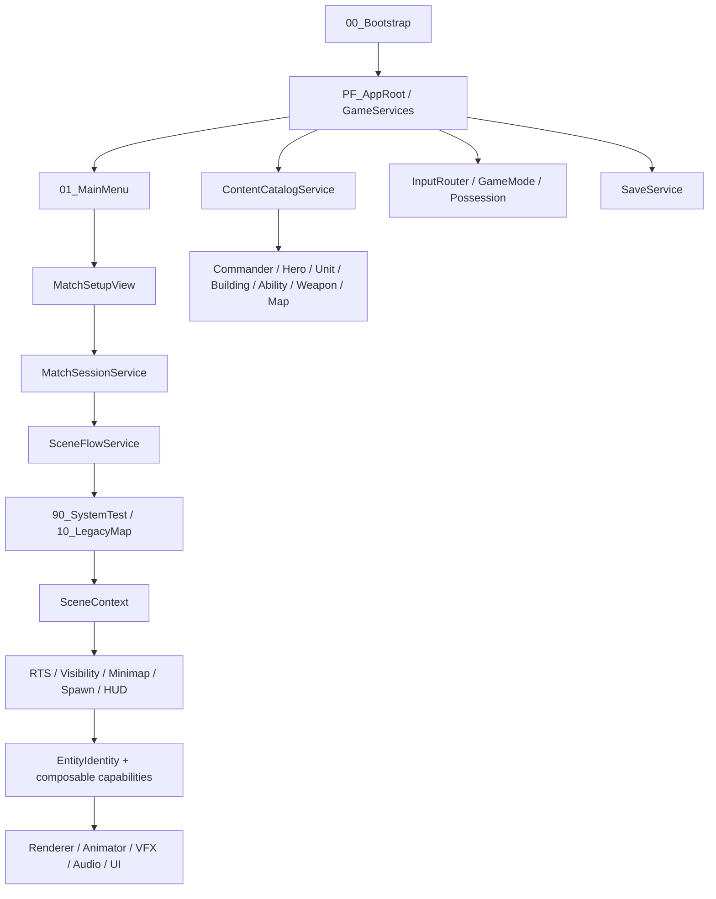

# OriginCore 技术设计文档（2026-08-18 As-Built）

- 文档状态：当前工程 As-Built；更新设计的详细实现与验收见更新技术设计
- 更新日期：2026-08-18
- Unity：2022.3.62f3
- Render Pipeline：URP 14.0.12
- Catalog revision：`origin-core-dev-7`
- Save schema：v3
- 适用范围：`Assets/_OriginCore` Runtime、内容资产、Prefab、场景与存档

> **更新设计提示（2026-08-18）：** `DesignDocs/设计文档.docx` 已补充三套 Y 武器、
> 高低地视野与敌方生产/进攻 AI。相关 Runtime、分地图高低地定义、地图级敌方 AI 配置及
> schema v3 已接线；三套武器 ActionSet 已序列化并由 WeaponDefinition 显式引用。本文记录
> 当前整体 As-Built，增量架构、动作规格、实施顺序、风险与验收统一见
> [DesignUpdateTechnicalPlan.md](DesignUpdateTechnicalPlan.md)。

## 1. 文档目的与需求边界

本文把以下来源统一为当前项目的技术设计：

1. 用户最新明确需求；
2. [RequirementsAddendum.md](RequirementsAddendum.md) 中的覆盖规则；
3. [设计文档.docx](../../../DesignDocs/设计文档.docx) 的玩法内容；
4. 当前 Runtime、ScriptableObject、Prefab、Scene、Build Settings 的实际实现；
5. [Architecture.md](Architecture.md)、[ImplementationStatus.md](ImplementationStatus.md) 与 [TestMatrix.md](TestMatrix.md) 的 foundation 历史证据。

出现冲突时按上述顺序解释。旧 P00～P17 只作为历史证据，不再恢复 `Tools/OriginCore`、阶段 Apply/Validate 菜单或永久 Editor 自动化。

截至 2026-08-18，设计中能够从现有规则唯一推导的系统已进入 Runtime、数据资产与地图配置。
以下内容仍不由实现层擅自补齐：

- 三套正式武器的最终动作时长、取消窗口、动画、模型、VFX、音频、图标和经济数值；
- 炮台最终平衡值、正式地图目标、波次、Boss、剧情和敌方英雄决策树；
- 每张正式地图最终烘焙的高度/悬崖数据与敌方 AI 平衡参数；
- 旧资源及后续正式资源的发布许可证明；
- 逐动作手感、敌方 AI 实战、高低地视觉和真实存档回放的人工运行验收。

## 2. 当前交付状态

| 能力域 | 状态 | 当前实现 |
|---|---|---|
| 启动与场景流 | 已实现 | 唯一 `AppRoot`、`GameServices`、`SceneBootProxy`、`SceneContext`；Bootstrap、Menu、SystemTest、LegacyMap 四个 Build Scene |
| 比赛配置 | 已实现 | Map、Commander、Hero、ACT 4 武器、FPS 6 候选与 3 个装备槽；Catalog revision 校验；新局/读档两条事务 |
| 输入与三模式 | 已实现 | `IA_OriginCore` → `InputRouter`；F1/F2/F3；首次有效直控输入恰好接管一次；ACT 目标锁定、ACT/FPS 武器轮盘、FPS 投掷物输入；暂停和 UI 抑制 |
| RTS Camera/选择 | 已实现 | 默认定位友方主基地；固定 60°、直接平移/缩放/定位；点击、Shift、框选、Worker/Combat 快捷选择 |
| RTS 命令 | 已实现 | Move、Stop、Attack、AttackMove、Build、Ability、Promote、Gather、Channel；current + 5 waiting |
| 战斗与数值 | 已实现 | Vitals、Armor、Damage flags、Regeneration、RuntimeStatBlock、阵营验证、死亡一次、复活 |
| 资源/建设/生产 | 已实现 | 三资源、人口、建设、批量生产、可见点部署、Rally、科技、晋升、临时寿命、采集与召唤 Worker |
| Y 英雄 | 已实现 | 三形态、RTS/ACT/FPS 能力、共享 Blink/Dash、Flight、孤立修正、直接命中回能、复活 |
| Z 指挥官 | 已实现 | 12 个单位族、8 建筑、生产/晋升/科技、Z.R 转换、永久观测策略 |
| 角色灰盒表现 | 已实现 | 18 个角色 Prefab 使用单一球体 `VisualRoot`；移动由 `MovementBobPresentation` 上下浮动表达，攻击由 `AttackEffectPresentation` 的阵营色光束和命中脉冲表达，均不改变 Gameplay 权威状态 |
| 武器与投掷物 | Runtime 与程序化特效已实现，最终素材待输入 | Gun、Revolver、Sword 通用管线；时隙之钥/时序之键/终焉之翼的 39 个序列化动作、输入仲裁、命中/控制/位移、目标与辅助槽；39/39 动作具备描述对应的程序化轨迹；投掷物选择/扣费/抛射/范围伤害 |
| UI | 已实现 | 贴边 HUD、正方形小地图、底部居中选择栏、右下 4×4 指令面板、一行资源、图形化 Vitals、直控轮盘 |
| Visibility/Minimap | 已实现，正式高度数据待验收 | 三态权威网格、分地图高度定义与 HeightAware solver、世界坐标黑色战争迷雾、地图边界空气墙、建筑记忆、独立地图底图、实体标记、Z 持续观测 |
| 敌方宏观 AI | 已接线待运行验收 | 阵营隔离 ProductionContext、确定性生产权重、普通单位五态 Director、地图级 Setup/Installer、Assault 存档恢复；英雄使用独立可见目标索敌与 AttackCommand 基础循环 |
| Save/Load | 已实现 | schema v3、v1→v2→v3 migration、原子文件、比赛/实体/建设/敌方 AI/生产/采集/装备/技能/科技/迷雾/模式 |
| 旧地图迁移 | 已实现结构闭环 | `10_LegacyMap` 保留旧环境几何，替换为新架构、独立小地图、NavMesh、Z 起始资产和 Crystal 节点 |

正式地图任务、Boss、敌方英雄策略和最终平衡数据仍属于内容输入缺失。三套 Y 武器、高低地视野
与敌方宏观 AI 已具有 Runtime/数据实现，并已通过 Unity AssetDatabase、Prefab、场景引用和 Console
静态验收；正式表现、地图烘焙数据及逐动作/AI 实战/存档回放仍是内容或人工验收缺口。

## 3. 总体架构



### 3.1 状态所有权

| 层级 | 权威所有者 | 主要状态 |
|---|---|---|
| 应用 | `AppRoot` / `GameServices` | 输入、设置、场景流、内容目录、存档仓库、比赛会话 |
| 比赛 | `MatchSessionService` | `MatchConfiguration`、当前 Commander/Hero/Map、初始资源策略 |
| 场景 | `SceneContext` | Camera、HUD、RTS 服务、Bounds、Visibility、Spawn 引用 |
| 实体 | `EntityIdentity` 与 capability | Vitals、阵营、命令、能力、装备、临时寿命、生产/建设状态 |
| 表现 | View/Presenter | 事件驱动 UI、Renderer、VFX、Audio；不得反写权威资源或模式 |
| 定义 | ScriptableObject | 稳定 ID、数值、Prefab、解锁关系；不得保存运行时冷却和当前血量 |

`OriginCore.Runtime` 不引用旧 `Assembly-CSharp`。旧工程只作为只读算法、美术和场景几何来源。

### 3.2 主要目录

```text
Assets/_OriginCore/
  Art/                    新 UI、材质及迁移图标
  Data/Content/           Catalog、Y、Z、Weapons、Maps
  Data/Configs/           SceneCatalog、移动与显示配置
  Prefabs/                Core、UI、Units、Buildings、Weapons
  Scenes/                 00_Bootstrap、01_MainMenu、90_SystemTest、10_LegacyMap
  Scripts/Runtime/        Core、Matches、Combat、RTS、ACT、FPS、Save 等
  Docs/                   本文、覆盖需求、历史状态和验证矩阵
```

## 4. 启动、菜单与比赛会话

Build Settings 顺序为：

1. `Assets/_OriginCore/Scenes/00_Bootstrap.unity`
2. `Assets/_OriginCore/Scenes/01_MainMenu.unity`
3. `Assets/_OriginCore/Scenes/90_SystemTest.unity`
4. `Assets/_OriginCore/Scenes/10_LegacyMap.unity`

`SceneCatalog` 登记 `MainMenu`、`system_test_0` 和 `legacy_map`。任何 Gameplay Scene 只允许一个 SceneBootProxy、SceneContext、Main Camera、EventSystem 和 AudioListener；直接从 Gameplay Scene 进入 Play 时由 BootProxy 补建唯一 AppRoot。

`MatchConfiguration` 保存：

```text
gameModeSource
mapId / sceneKey / missionId
commanderId / heroId
actWeaponIds[4]
fpsAvailableWeaponIds[6]
fpsEquippedPrimary / Secondary / Melee
contentRevision
```

`MatchSessionService` 的新局事务为：Catalog 校验 → 设置 Commander 初始资源/人口/科技/Visibility policy → 加载 sceneKey → 绑定 SceneContext → 在可用锚点生成 Hero → 配置能力与武器 → 初始化 HUD。失败不提交半初始化会话。

读档先读取纯数据头并校验 sceneKey 与 contentRevision，再准备 MatchSession、切场景并按 participant 顺序恢复。Load 路径不会重复套用 Commander 初始资源。

选择页首次进入时自动填入 Gun、Revolver、Sword；玩家仍可逐槽清空或替换。SystemTest fallback 同样使用 catalog revision 6 和三把默认武器。

## 5. Content Catalog 与数据契约

`SO_ContentCatalog.asset` 是稳定 ID 的唯一索引。当前登记：

- 2 Commander、2 Hero、3 HeroForm；
- 27 Unit/Entity registrations、8 Building；
- 16 Ability、3 Weapon、2 Technology、5 Promotion；
- 2 Map；正式 Mission 内容为 0。

约束如下：

- ID 使用小写分域格式，例如 `commander.z`、`hero.y`、`z.production.bs1`、`weapon.gun`；
- ID 唯一且 Save 只保存 ID，不保存显示名、GUID 或 Unity 实例引用；
- Unit/Building Prefab 根的 `EntityIdentity` 必须与定义匹配；
- Spawner 优先通过 Catalog 解析 archetype，旧 Worker/Combat 字段只保留兼容回退；
- 解锁、科技、晋升和生产引用必须可解析；
- Catalog revision 进入 MatchConfiguration 与存档头。

## 6. 输入、模式、Camera 与接管

所有 Gameplay 输入只从 `IA_OriginCore` 进入 `InputRouter`：

- Global：F1 RTS、F2 ACT、F3 FPS、Esc；
- RTS：指针、选择、右键语境命令、Move/Attack/Stop、Shift 队列、能力槽；
- ACT：移动、视角、跳跃、蹲伏、Shift 目标锁定、主动作、Q/E 循环武器、Tab 武器轮盘、形态与能力、5 召唤 Worker；
- FPS：移动、视角、跳跃、蹲伏、疾跑、ADS、主动作、1/2/3 装备槽、Tab 武器轮盘、4 投掷物、形态与能力、5 召唤 Worker；
- UI：导航、确认、取消、指针、滚动。

模式事务顺序为：验证 Pawn → 切 Action Map → 更新 Possession → Camera/HUD/Cursor → 发布一次 `ModeChanged`。首个有效直控动作会恰好一次清除 Hero RTS 队列并从 NavMesh autopilot 切到 CharacterController；纯 Look、旧帧按住状态、暂停/UI 抑制不接管。

RTS Camera 固定 60°，只直接平移、缩放和即时定位，不使用旋转、Lookahead 或阻尼。ACT 使用第三人称 Orbit，FPS 使用第一人称视角和可逆 ADS FOV。Camera 不写实体位置，也不是小地图底图来源。

ACT 按住 Shift 时，`TargetLockController` 只在当前可见、存活、敌对、40m 范围内选择最近目标；锁定后不因出现更近目标而切换，直到松开 Shift、目标死亡/失效、离开 ACT 或目标越界。锁定期间通过 `ActMovementController.SetCameraLookDirection` 让视角持续朝向目标，不改写目标或 Pawn 的 Transform。

ACT/FPS 按住 Tab 打开当前 Hero 的武器轮盘，鼠标位移累积为径向选择向量；直控 Cursor 锁定时不依赖绝对屏幕坐标，轮盘打开期间相机 Look 被门控。松开 Tab 后 ACT 只切换已有武器，FPS 对未装备候选执行同一资源事务的购买/替换/返还。轮盘显示定义中的购买成本与按 `RefundRatio` 计算的卖出值。

FPS 的 4 键采用短按/长按双语义：短按装备或循环 Hero 可用投掷物，按住 0.35s 打开投掷物轮盘，松开确认；装备投掷物后左键只投掷一次，不同时触发枪械。按 1/2/3、离开 FPS 或输入抑制会解除投掷物装备状态。

FPS 疾跑采用阈值锁存：按 Shift 加速；未到最低疾跑速度前松开会回落；达到阈值后松开或再按 Shift都不关闭；真正停止后下一次移动从行走速度开始；离开 FPS 清除状态。

## 7. 实体、数值、战斗与复活

可战斗实体按需组合：

```text
EntityIdentity + FactionMember
VitalsComponent + DamageReceiver + RuntimeStatBlock
Selectable / VisionEmitter / VisibilityTarget
NavMeshMovementDriver + UnitCommandQueue
HybridControlDriver + HybridPawnMotor
AttackCapability / AbilityLoadout / WeaponInventory
```

`RuntimeStatBlock` 以基础定义加来源明确的 Add/Multiply/Override modifier 计算 Health、Shield、Armor、Energy、MoveSpeed、Damage、AttackInterval、Range、CooldownRate、DamageDealt/Taken、Regen 等最终值。Y 形态、孤立规则、Z Commander bonus、科技与武器移速惩罚均复用同一管线。

伤害顺序：合法性/阵营 → 来源与目标倍率 → Armor → Shield → Health → 一次事件发布。`IgnoreArmor`、`IgnoreShield`、Area、Periodic 等语义由 `DamageInfo` flags 表示；Ability/Weapon ID 随伤害一起传播。

死亡清理命令、选择、攻击、碰撞与人口只执行一次。Hero 使用 `RespawnController`：按 HeroDefinition 倒计时，在可用 `HeroSpawnAnchor` 复活；Y 可按规则支付 800 Crystal 立即复活，形态倍率影响复活时间。

## 8. RTS 选择、命令和 4×4 面板

`SelectionService` 每个 RTS 输入快照使用现有 selection mask 解析当前鼠标下最近的存活 Hero/Worker/Combat/Building，并把结果交给场景内唯一的 `UnitHoverIndicatorView`；无 Collider 的 Stable Rift 复用屏幕空间候选解析。该 View 程序化生成 16 段虚线环，按目标 Collider/Renderer 底面定位和缩放，使用 overlay shader 避免被地形遮挡，并以 unscaled time 持续旋转。阵营关系为 Hostile 时使用红色，否则使用青色。Hover 不写入 `Selectable.State`，因此不会覆盖 Preview/Selected/Inspected；UI、框选、目标选择、模式退出和实体注销统一清空。

选择规则：友方可指挥单位进入 Command Selection；敌人只进入 Inspect；Shift 支持追加；快捷选择只返回可指挥、存活、可见对象。世界血条直接订阅 Vitals，掉血后比例立即同步。

每个 `UnitCommandQueue` 保存一个 current 和最多五个 waiting：非 Shift 先停止旧命令，Shift 追加；终态只推进一次；Stop、死亡、Disable、读档和首次手动接管会清除瞬态命令。

已接入的命令与路线：

| 命令 | 目标 | 路线 |
|---|---|---|
| Move / Rally | 世界点 | 白色虚线 |
| Attack / AttackMove | 实体或世界点 | 红色虚线 |
| Gather | ResourceNode，往返 Dropoff | 白色虚线 |
| Build / Ability / Promote / Channel | 定义化目标 | 不显示路线 |

点击 Move、Attack、技能或 Rally 后用后续左键松开确认；右键不释放 targeting。非 targeting 时右键地面为 Move，选中生产建筑时直接设置 Rally，右键 ResourceNode 为 Gather。

右下角指令面板为 4×4 正方形。可移动单位选中时第一行按能力呈现 Move、Attack、Stop、Cancel；Attack 只在所选单位拥有 `UnitCommandQueue.AttackCapability` 时可用。仅选中建筑时隐藏 Move、Attack 与 Stop 并保留对应空槽；炮台通过自动索敌攻击，不暴露无法进入其自动攻击链的手动 Attack/Stop。生产、研究、建设等动态指令仍维持原有固定位置，不向前补位。其余槽动态呈现 Worker 建筑、生产、研究、晋升、Hero/单位能力和 Armory 武器交易；无 descriptor 的槽保持不可交互。面板采用暗色半透明底板、完整内外描边和阴影，基础/能力/建设/生产/研究/部署/晋升/武器交易分别使用稳定分类强调色，空槽与禁用槽降低对比度。旧独立生产/队列文字面板在 Gameplay Scene 中关闭。

## 9. 经济、建设、生产、科技与采集

### 9.1 资源与事务

Runtime 使用 CommanderResource、Crystal、Influence 三类资源。Z 把 CommanderResource 显示为 `Z.R`，固定人口上限 100。所有扣费先完整校验，再一次提交；失败、取消、晋升回滚和死亡释放均防止重复退款/释放。

### 9.2 建设和生产

BuildCommand 在可见、可达、未被占用的位置预留成本并移动 Worker；到达后再次验证，创建 ConstructionSite，随后消耗 Worker。建设完成才启用 ProductionQueue、UnitSpawner、Rally、Attack、Dropoff 或自动采集 capability。

ProductionRecipe 支持 batch、成本/人口、生产时间、科技解锁和 Rally/ProducerExit/WorldTarget 三种生成策略。WorldTarget 产物必须在当前可见且可用的 NavMesh 位置整批部署；失败保持待部署状态，不重复扣费。

`UnitSpawner` 在实际解析 Definition 或 archetype ID 时按需补绑 `ContentCatalogService`。这使通过 Bootstrap/主菜单建立的标准 Match 与由 `SceneBootProxy` 支持的 Gameplay Scene 直启采用同一生产结果，不再依赖 `Awake` 顺序；序列化 Worker/Combat 槽仅作为兼容回退。Rally 路线和落点分别使用统一命令 Overlay 与 `MAT_RallyMarkerOverlay`，两者都不参与地形深度遮挡。

Technology 与 Promotion 都进入资源事务和 RuntimeStatBlock。BS1～BS5 使用 180 秒 Lifetime；晋升替换为永久 S 单位时保留稳定 runtime ID、位置/朝向和选择关系。Z.S5 bombard 由可中断 channel/auto-repeat 运行，Move/Stop/死亡/接管会终止。

### 9.3 Z.R 转换

凝聚信标上的 `ProductionResourceConverter` 在 `z.rule.crystal_to_zr` 解锁后，根据完成配方消耗的 Crystal 按 1:1 产出 Z.R。空之祭坛提供该解锁。比例保留为可配置字段，因为原始设计没有给出最终倍率。

### 9.4 采集和 Worker 召唤

RTS Worker 右键 Crystal Node 后循环执行：移动到节点 → 采集至满载/枯竭 → 最近友方 Dropoff → 存入 ResourceService → 未枯竭则返回。资源点余量和 Worker 携带量进入 Save participant。

Crystal Node 的外观使用 `Art/Models/Environment/Resources/SM_ResourceCrystal.fbx`，模型导入按厘米到米设置 `globalScale = 100` 并关闭动画。FBX 自带的 2048×2048 BaseColor、Normal、Metallic、Roughness 已提取到 `Art/Textures/Environment/Resources/ResourceCrystal` 并按 `T_ResourceCrystal_*` 标准命名；Metallic 与 Roughness 只为兼容 URP Lit 额外打包为 MetallicSmoothness，未修改原始颜色。素材自身的材质描述复制为 `Art/Materials/Environment/MAT_ResourceCrystal.mat`，并通过 ModelImporter remap 回映射到 FBX，避免同名贴图误匹配旧版 `Assets/Art`。`PF_ResourceCrystal` 的单一 `VisualRoot` 以 2.5 倍实例化该网格；根上的 `ResourceNode`、`EntityIdentity`、阵营与采集碰撞仍保持 Gameplay 权威。

采集信标的正式外观使用 `Art/Models/Buildings/Z/SM_Z_GatheringBeacon.fbx`。FBX 自带的 BaseColor、Normal、Metallic、Roughness 提取到 `Art/Textures/Buildings/Z/GatheringBeacon`，统一命名为 `T_Z_GatheringBeacon_*`；Metallic 与反转 Roughness 另行打包为 URP Lit 使用的 MetallicSmoothness。外部材质 `Art/Materials/Buildings/Z/MAT_Z_GatheringBeacon.mat` 保留素材自身的颜色和表面信息，并通过 ModelImporter remap 固定绑定，禁止按同名资源回退到旧版 `Assets/Art`。`PF_Z_gather_beacon` 的模型缩放为约 2.4×2.25×2.4，Definition footprint 与 BoxCollider XZ 同为 2.4×2.4，接近 Crystal Node 的约 2.24×1.75；Prefab 根节点 GUID、`BuildingRuntime`、`ConstructionSite`、`AutomaticResourceExtractor`、血条和选择契约保持不变。

传输信标的正式外观使用 `Art/Models/Buildings/Z/SM_Z_TransportBeacon.fbx`。素材内嵌的 BaseColor、Normal、Metallic、Roughness 提取到 `Art/Textures/Buildings/Z/TransportBeacon` 并统一命名为 `T_Z_TransportBeacon_*`，Metallic 与反转 Roughness 打包为 URP Lit 的 MetallicSmoothness；`Art/Materials/Buildings/Z/MAT_Z_TransportBeacon.mat` 保留原素材的灰白结构和浅蓝核心，不复用友军占位材质。`PF_Z_transport_beacon` 只替换原立方体与顶部标记，正式模型的表现尺寸约 3.57×3.98×3.81，继续使用原 4×3×4 BoxCollider；Prefab GUID、`UnitSpawner`、`ProductionQueue`、`ResourceDropoff`、`RallyPointController`、建设流程、血条、选择指示和锚点保持不变。

凝聚信标的正式外观使用 `Art/Models/Buildings/Z/SM_Z_CohesionBeacon.fbx`。内嵌 BaseColor、Normal、Metallic、Roughness 提取到 `Art/Textures/Buildings/Z/CohesionBeacon` 并按 `T_Z_CohesionBeacon_*` 命名，Metallic 与反转 Roughness 额外打包为 MetallicSmoothness；`Art/Materials/Buildings/Z/MAT_Z_CohesionBeacon.mat` 保留素材原有的灰白金属、紫色能量和表面细节，并通过 ModelImporter remap 固定绑定。`PF_Z_cohesion_beacon` 只替换原立方体与顶部标记，正式模型表现尺寸约 3.91×3.11×3.91，继续使用原 4×3×4 BoxCollider；Prefab GUID、唯一建筑约束、`ProductionQueue`、`ProductionResourceConverter`、WorldTarget 部署、建设流程、血条、选择指示和集结/出生锚点保持不变。

武器库的正式外观使用 `Art/Models/Buildings/Z/SM_Z_Armory.fbx`。素材内嵌的 BaseColor、Normal、Metallic、Roughness 提取到 `Art/Textures/Buildings/Z/Armory` 并按 `T_Z_Armory_*` 命名，Metallic 与反转 Roughness 打包为 MetallicSmoothness；`Art/Materials/Buildings/Z/MAT_Z_Armory.mat` 保留素材原有的灰白结构、紫色能量平台和晶体细节，并通过 ModelImporter remap 固定绑定。`PF_Z_armory` 只替换原立方体与顶部标记，正式模型表现尺寸约 3.89×3.54×3.96，继续使用原 4×3×4 BoxCollider；Prefab GUID、武器交易/解锁内容绑定、`BuildingRuntime`、`ConstructionSite`、生命、血条和选择指示保持不变。

稳定裂隙不使用立体建筑模型。其正式外观为 ImageGen 生成的顶视魔法法阵 `Art/Textures/Buildings/Z/StableRift/T_Z_StableRift_MagicDecal.png`，经过背景分离后保存真实 Alpha，以 `Art/Materials/Buildings/Z/MAT_Z_StableRift.mat` 的 URP Unlit Transparent 材质显示。`PF_Z_stable_rift` 的 `VisualRoot` 是位于地面上方 0.025 米、旋转 90° 的 4.8×4.8 Quad；材质双面、Clamp、关闭 ZWrite、投影、接收阴影、光照探针和反射探针。Prefab 仍保持 0 Collider；`SelectionService` 仅在物理射线没有命中 Selectable 时，使用 36 像素半径的屏幕空间兜底选择无碰撞体的友方实体，因此裂隙可点击但不会进入攻击或寻路碰撞。原 GUID、`HeroSpawnAnchor`、自动生成、不可攻击、`BuildingRuntime` 与建设状态不变。

炮台的正式外观使用 `Art/Models/Buildings/Z/SM_Z_Turret.fbx`。FBX 内嵌的 BaseColor、Normal、Metallic、Roughness 提取到 `Art/Textures/Buildings/Z/Turret` 并按 `T_Z_Turret_*` 命名，Metallic 与反转 Roughness 打包为 MetallicSmoothness；`Art/Materials/Buildings/Z/MAT_Z_Turret.mat` 保留素材原有的灰白悬浮炮体、圆形基座与紫色能量细节，并通过 ModelImporter remap 固定绑定。`PF_Z_turret` 只替换原立方体与顶部标记，正式模型表现尺寸约 3.95×3.35×3.67，继续使用原 4×3×4 BoxCollider；Prefab GUID、`AttackCapability`、`AutoTargetScanner`、`BuildingRuntime`、`ConstructionSite`、生命、血条和选择指示保持不变。`TurretAutoAttackController` 只在 Operational 且 `AttackCapability` 启用时，以 0.2 秒间隔扫描并复用标准攻击/伤害管线；当前可配置基线为 Range 10、Damage 10、Cooldown 0.5 秒。当前素材为单一合并网格，因此索敌与攻击保持逻辑驱动，不承诺炮体独立旋转动画。

空之祭坛的正式外观使用 `Art/Models/Buildings/Z/SM_Z_SkyAltar.fbx`。FBX 内嵌的 BaseColor、Normal、Metallic、Roughness 提取到 `Art/Textures/Buildings/Z/SkyAltar` 并按 `T_Z_SkyAltar_*` 命名，Metallic 与反转 Roughness 打包为 MetallicSmoothness；`Art/Materials/Buildings/Z/MAT_Z_SkyAltar.mat` 保留素材原有的灰白圆环、紫色符文与中央星形结构，并通过 ModelImporter remap 固定绑定。`PF_Z_sky_altar` 只替换原立方体与顶部标记，正式模型是约 3.94×0.35×3.95 的低矮平台，继续使用原 4×3×4 权威 BoxCollider；Prefab GUID、Crystal→Z.R 解锁、晋升/BS4/BS5 内容绑定、`BuildingRuntime`、`ConstructionSite`、生命、血条和选择指示保持不变。

地形分析所的正式外观使用 `Art/Models/Buildings/Z/SM_Z_TerrainAnalysisLab.fbx`。FBX 内嵌的 BaseColor、Normal、Metallic、Roughness 提取到 `Art/Textures/Buildings/Z/TerrainAnalysisLab` 并按 `T_Z_TerrainAnalysisLab_*` 命名，Metallic 与反转 Roughness 打包为 MetallicSmoothness；`Art/Materials/Buildings/Z/MAT_Z_TerrainAnalysisLab.mat` 保留素材原有的灰白环形结构、紫色能量与晶体细节，并通过 ModelImporter remap 固定绑定。`PF_Z_terrain_lab` 只替换原立方体与顶部标记，正式模型表现尺寸约 3.95×2.76×3.95，继续使用原 4×3×4 BoxCollider；Prefab GUID、Adaptive Enhancement 研究内容绑定、`BuildingRuntime`、`ConstructionSite`、生命、血条、选择指示和集结/出生锚点保持不变。

ACT/FPS 中，只有当前被接管 Hero 的屏幕中心射线首先命中未枯竭 ResourceNode 时，按 5 才会请求最近友方 UnitSpawner 生成 Z.W；成本直接复用 `SO_Recipe_Z_Worker`，因此当前为 30 Crystal + 1 Influence。

原始设计未给采集数值，当前使用可配置实现默认值：

| 项目 | 默认值 |
|---|---:|
| Crystal Node 容量 | 5000 |
| Worker 携带量 | 10 |
| Worker 采集速率 | 2/s |
| 交互距离 | 1.5 |
| 采集信标搜索半径 | 2 |
| 采集信标速率 | 1/s |
| 召唤准星射线距离 | 500 |

采集信标必须直接放在未枯竭 Crystal Node 上，且只在建设完成、BuildingRuntime operational 后采集。它使用 EntityRegistry 的低频查找，不做每帧全场对象扫描。

## 10. Z 指挥官实现

`SO_Commander_Z.asset` 配置固定人口 100、Z.R 标签、Hero CooldownRate ×1.25（等价于冷却时间 -20%）和 `ExploredRemainsObserved`：Z 已探索单元不会降回 Explored，而会持续作为 Visible 提供实时信息。

单位族已登记 Z.W、BS1～BS5、E、S1～S5 和 S3Clone。设计给出的伤害、攻击间隔、范围、移动、Vitals、Armor、批量、成本、Lifetime 和晋升关系均落在 UnitDefinition、ProductionRecipe、PromotionDefinition 与 AbilityDefinition。

建筑实现：

| 建筑 | Runtime capability |
|---|---|
| 传输信标 | Worker 生产、Crystal Dropoff、Rally |
| 稳定裂隙 | 自动生成、不可攻击/无碰撞、HeroSpawnAnchor |
| 采集信标 | Crystal Node 专用自动采集 |
| 凝聚信标 | 唯一建筑、BS/E 批量生产、WorldTarget 部署、Z.R 转换 |
| 武器库 | 武器购买/替换与解锁 |
| 炮台 | Operational 后自动扫描并通过标准 AttackCapability 攻击；实现基线 Range 10 / Damage 10 / Cooldown 0.5s，最终平衡值待定 |
| 空之祭坛 | 解锁 Crystal→Z.R、晋升研究、BS4/BS5 |
| 地形分析所 | Adaptive Enhancement：200 Crystal / 60s，Z.S5 CooldownRate ×1.25 |

原设计对 BS1 人口有矛盾。当前数据采用整批 4 Influence，即每只 1；S5 晋升采用 3 Influence。两者均集中在资产中，可在平衡确认后修改，不需要改 Runtime。

### 10.1 灰盒角色表现

当前 18 个角色 Prefab 没有 Animator 或 Animation 组件。角色本体统一为根级单一球体 `VisualRoot`，保留原阵营材质、受击闪白引用和 Hero 第一人称隐藏引用；选择圈、世界血条、相机 Target、碰撞体与 Final Wing 等功能性表现保持独立。

`MovementBobPresentation` 挂在角色 Prefab 根，但只写入 `VisualRoot.localPosition.y`。它优先读取 `NavMeshMovementDriver.IsMoving`、NavMeshAgent/CharacterController 速度，并以根 Transform 平面位移作为战斗位移兜底；停止后归零，暂停不推进相位，Disable 恢复基准位置。因此浮动不改变寻路位置、碰撞、可选取、命令路线、小地图 Marker 或存档 Transform。

这只是正式模型/动画缺失期间的灰盒动作提示，不把浮动解释为攻击动画，也不为未提供的正式动作虚构 AnimationClip。正式动作动画不是当前实现要求。

`AttackEffectPresentation` 作为独立表现消费者订阅 `AttackCapability.AttackPerformed`、`WeaponController.ShotFired`、`WeaponActionController.ActionStarted` 与 `CombatHitboxResolver.HitApplied`：普通攻击和动作命中显示起点到目标的光束及命中脉冲，无法取得目标的射击/动作开始事件显示短距离朝向光束。颜色只取自 `FactionMember`，运行时临时节点不参与碰撞，生命周期使用缩放时间，因此暂停时冻结。该组件不调用伤害、Hitbox、冷却、资源、位移或命令 API，不能成为 Gameplay 时机源。

18 个角色 Prefab 共用 `MAT_AttackEffect` 透明 URP Unlit 材质。正式模型或专用武器特效接入后，可以按角色替换/关闭该通用表现，但不能移除既有 Gameplay 事件或把伤害判定移进特效脚本。

## 11. Y 英雄实现

Y 的基础定义为 HP 400、Shield 400、Armor 3、Energy 3000、Energy regen 1/s、复活 240s。`HeroFormStateMachine` 提供 Base、Released、Final 三阶段，并在形态切换/读档时重建 loadout 与 modifier，不序列化 Animator state 或委托。

RTS 能力已覆盖 Blink、急袭斩、裂空斩、力量解放、裁决、裂解、最终解放、天启、审判；伤害形状、Ignore flags、回位、多段命中、击杀/命中回能和目标攻击力比例回能由 AbilityEffect 链执行。

ACT/FPS 使用 DirectAbilityController：Dash 与 RTS Blink 共用 cooldown group 和 charges；蓄力形态切换、Flight、直控形态倍率、孤立增伤/减伤及安全落地均由独立 capability 组合。模式切换不会复制或重置共享冷却。

`DirectHitEnergyReward` 监听 `DamageReceiver.AnyDamageApplied`，只在 Y 是当前直控 Pawn、伤害确实改变敌方 Vitals 且 `DamageInfo.Source` 为 Y 时恢复 1 Energy。原设计写作“命中恢复 1 SP”，但项目没有独立 SP 资源，因此当前把 SP 解释为 Y 的 Energy；未造成有效伤害、他人伤害和 RTS 自动攻击不触发。

原设计对“1.6 基础移速与 1.4 直控倍率是否叠加”“部分形态倍率相对哪一阶段”没有唯一解释。当前权威值在 Y 的 Unit/Form/MovementConfig 资产中；调整只改资产，不在控制器追加特殊分支。

## 12. 武器系统

`WeaponInventory` 是 ACT/FPS 共享库存：ACT 最多 4 把并循环选择；FPS 最多 6 把候选，同时装备 Primary、Secondary、Melee。Armory 和 FPS 轮盘交易按“扣新成本 → 安装 → 返还旧武器比例”提交，失败完整回滚。

`HeroDefinition.RequiredActWeapons` 定义角色不可卸下的有序 ACT 专武列表。Hero Y 依次声明
时隙之钥、时序之键和终焉之翼，比赛配置 ACT 第 1～3 槽是其规范槽位，第 4 槽保留给一个其他
武器。`MatchSetupView` 把前三槽显示为 `REQUIRED`，每槽只提供对应专武且不能清空；
`MatchConfiguration.EnsureRequiredActWeapons` 同时作为配置事务边界，在新局、外部配置和旧存档进入
验证时把缺失/错位/重复的三把专武按声明顺序归一化，并按原顺序保留最多一个其他唯一武器。因此
UI 限制不是唯一防线，绕过菜单的配置也不能生成缺少任一专武的 Hero Y。配置数组加载到
`WeaponInventory` 后，终焉之翼仍按 `Auxiliary` 角色进入独立辅助槽，不占主手切换列表；没有声明
必带专武的其他 Hero 保持原有四槽行为。

`WeaponController` 负责 hitscan、projectile fallback、melee、射速、弹匣、自动换弹、腰射/ADS 扩散、滞空附加扩散、DamageInfo.weaponId 和模型呈现。远程武器激活时通过 sourceId 为 `weapon.active.move_speed` 的 stat modifier应用 0.95 移速倍率，切走后精确移除。

当前内容：

| 武器 | 槽位 | Damage | 当前实现默认值 |
|---|---|---:|---|
| Gun | Primary | 20 | Range 50、0.25s/发、12+48、Reload 1.5s |
| Revolver | Secondary | 20 | Range 50、0.4s/发、6+36、Reload 1.5s |
| Sword | Melee | 40 | Range 2.5、0.7s/次 |

Gun 和 Sword 的伤害来自旧项目可确认值；Revolver 复用旧 Gun 视觉。三把通用武器没有正式
价格、弹药和射速输入，因此价格暂为 0，通用操作数值是可配置实现默认值，三份 `_weaponSkills`
保持空数组。

Y 的正式武器使用独立动作系统，不回填通用 `_weaponSkills`：

| 武器 | EquipRole | 解锁 | 动作资产 | Runtime 重点 |
|---|---|---|---|---|
| 时隙之钥 | MainHand | Base | 17 个动作 | 地/空连段、方向/锁定派生、剑气、裂隙、目标斩、`CrossThroughAndReturn` |
| 时序之键 | MainHand | Released | 16 个动作 | 地/空连段、投掷回收、冻结动作起点的持续旋转镰刀、拉拽/击飞/下砸 |
| 终焉之翼 | Auxiliary | Final | 6 个动作 | 显式锁定优先的自动目标、单击一轮/按住续轮的目标限定副手攻击、逐主武器命中被动队列、持续技和两个跨武器终结技 |

`DirectCombatInputResolver` 把物理输入解析为不可变意图；`WeaponActionController` 负责阶段、
连段、中断和 Cleanup；`WeaponActionExecutor` 统一驱动 Motion、Hitbox 与 Status。主手和辅助武器
分别冻结目标意图，主武器锁定招式不会因终焉之翼自动索敌而错误成立。离开 ACT、死亡、读档、
目标失效或合法外部动作中断时，当前动作统一清理。详细输入优先级、伤害公式和每个动作规格见
[DesignUpdateTechnicalPlan.md](DesignUpdateTechnicalPlan.md)。

`WeaponSkillVfxPresentation` 是 Hero Y 的专属纯表现层。它对 39 个稳定 Action ID 做穷举映射，
从 ActionStarted 的冻结意图读取起点/目标，从 HitApplied 读取实际命中位置，从 ActionEnded 统一淡出。
时隙之钥使用青蓝剑痕、冲刺残影、剑气和裂隙；时序之键使用紫色镰弧、幻影、投返路径与持续轨道；
终焉之翼使用金白六翼路径、六边形对角斩和相反旋向的终结轨道。组件只创建无碰撞 LineRenderer，
不调用 Executor、DamageReceiver、Status、Motor、Cooldown、Resource 或 Targeting API。

Hero Y 存在专属组件时，`AttackEffectPresentation` 不再订阅其 WeaponAction/Hitbox 事件，避免通用直线
光束覆盖专属配方；普通 AttackCapability 与通用枪械事件仍可按原规则显示。专属动作结束、取消、死亡、
形态切换或 Disable 后，所有运行时线条淡出/销毁，且不写入 Prefab 或 Scene。

投掷物与枪械分离为 `ThrowableDefinition`、`ThrowableController`、`ThrowableProjectile`：定义保存每次使用成本、伤害、范围、投速、引信、最大寿命、碰撞起爆策略和视觉 Prefab；Controller 管输入、Hero 专属列表、选择、扣费与失败退款；Projectile 负责重力轨迹、碰撞/引信和敌对范围伤害。投掷伤害仍统一进入 `DamageReceiver`，不会绕开阵营、Armor/Shield 或 Y 的命中回能管线。

原设计只规定“投掷物由英雄决定、最多通过 4 键轮换/轮盘、每次消耗 Crystal”，没有给出任何投掷物名称、数值或素材。因此 Runtime 和两个 Gameplay 场景的轮盘已经接通，但 Y 与占位 Hero 的 `_available` 数组有意为空；没有创建伪造的正式投掷物资产，也没有把它计入当前 Catalog 数量。

## 13. UI 设计

Gameplay HUD 全部贴窗口边缘：

- RTS：256×256 正方形小地图贴左下；选择栏底部居中；360×360 的 4×4 指令面板贴右下；Roster 贴左；三项资源一行贴右上最边缘；
- ACT：左上图形化 Health/Shield/Energy，左下武器状态；
- FPS：左下图形化 Health/Shield/Energy，中央点准星，右下武器/弹药；
- ACT/FPS：Tab 武器轮盘位于屏幕中央；FPS 长按 4 使用同规格投掷物轮盘；两者以 `CanvasGroup` 隐藏，不拦截常驻 UI 射线；
- 不显示模式名称、F1/F2/F3 或常驻按键提示；
- 指令槽各自绘制完整四边框，避免相邻列缺边；
- 世界和直控 Vitals UI 订阅实际数值事件，不用静态文字或初始化快照。

MatchSetup、指令面板、武器 HUD、资源 HUD、Minimap 和 Vitals 都由 Presenter/View 读取服务或运行时状态；Button 不直接扣资源或生成 Gameplay Prefab。

Options 的动态 Input Binding 行由 `OriginCoreUiTheme` 单独分层：行底使用浅蓝晶体色，动作名使用
深蓝文字；Rebind Button 使用深蓝底、白色粗体按键名与青色边框。全局屏幕 UI 使用的
`F_NotoSansSC_SDF` 来源字面为 Thin，因此主题为非保护文本统一追加 TMP 合成 Bold，避免大写 `I`
等窄字形在 13～17px 下视觉消失。绑定行在运行时刷新后由主题扫描重新应用，不依赖模板初始颜色。

当前 UI 仍以英文为主。旧 `NotoSansSC-VF.ttf` 没有可确认许可，因此未纳入 `_OriginCore` 正式字体链；中文本地化和字体仍是发布内容任务，不影响玩法 Runtime。

## 14. Visibility、黑色战争迷雾与独立小地图

`VisibilityGrid` 是唯一权威数据，默认 cell 2m、5Hz，状态为 Hidden/Explored/Visible。选择、敌人
Renderer、建筑记忆、小地图标记和 Save 只读该网格，不读 Shader 结果。`MapDefinition` 现在引用
地图专属 `VisibilityElevationDefinition`，`HeightAwareVisibilitySolver` 在同一 XZ 网格上结合观察者
高度、目标高度带、悬崖/遮挡标记决定本次 Visible。SystemTest0 与 LegacyMap 使用不同 revision，
当前由加载时几何采样生成原型数据；正式地图若存在装饰 Collider 或加载顺序不稳定，应改为烘焙数组。

三个 URP Renderer Data 继续通过已序列化的 `VolumetricFogRendererFeature` 类型承载绘制（类型名仅为旧资产兼容标识），但实际 Shader 已改为世界坐标黑色遮罩：每像素从 Camera Depth 重建当前表面位置，只在 `MapDefinition.WorldBounds` 内采样一次 Visibility texture；Hidden 与 Explored 为纯黑，Visible 透明，地图外与天空不绘制。该方案不再光线步进、生成空间噪声或按高度积分，因此不会随相机角度产生体积采样偏移。CPU 仍只在 Visibility tick 更新纹理。Z policy 会把已探索单元提升并保持为 Visible。

所有不使用 URP/Lit 的自定义不透明地形 Shader 必须提供 `LightMode=DepthOnly` 且开启 ZWrite。由于不同 URP 质量档可能选择 CopyDepth 或 DepthPrepass，自定义地形还必须直接用片元真实 `positionWS.xz` 采样同一张全局 Visibility texture；实体继续由 Renderer Feature 处理。`SH_AnimeGrassTerrain` 已同时提供 DepthOnly 与直接采样路径，避免地形被误判为天空或只让单位/建筑变黑。

`SceneContext.ConfigureWorldBounds` 在地图绑定时把 `MapDefinition.WorldBounds` 同时提交给 `VisibilitySystem` 与 `WorldBoundaryWalls`。后者在场景根生成 West/East/South/North 四个不可见、非 Trigger 的 `BoxCollider`，内侧面与地图边界重合，并向上下各延伸 100m；系统测试直启则以 Visibility bounds 回退配置。空气墙不参与导航权威，也不进入保存数据。

每张地图提供独立 `MinimapMapDefinition`。底图只在地图定义变化时构建；EntityRegistry 负责单位/英雄/建筑 Marker；Hidden 敌人不显示，建筑记忆使用最后已知位置。Camera 移动、缩放、CullingMask 和模式切换不会改变底图。小地图点击只做 normalized map coordinate → world coordinate → RTS Camera 定位。

## 15. Save/Load

当前 `SaveGameData.CurrentSchemaVersion = 3`，保留 v1→v2→v3 migration，并把已知
`origin-core-dev-6` 内容 revision 安全迁移到 `origin-core-dev-7`。文件使用 UTF-8 JSON、`.tmp` 和
replace/move 保证失败保留旧档。

Restore 顺序：

| Order | Participant | 持久内容 |
|---:|---|---|
| 50 | match-config | Map/Commander/Hero/Loadout/revision |
| 100 | entities | archetype、runtime ID、Transform、Faction、Vitals、modifier、Lifetime |
| 125 | construction | 全部 site、进度、operational 状态 |
| 150 | rally-points | Rally 世界点 |
| 160 | resource-gathering | ResourceNode 余量、Gatherer cargo |
| 165 | enemy-ai | 宏观阶段、Assault serial、生产 cursor、战略目标与敌方独立账户 |
| 170 | production-queues | 配方、剩余生产时间、预留状态 |
| 180 | inventory-abilities | 武器、弹药、装备槽、能力 cooldown/charges、Hero form |
| 200 | resources | 三资源与人口 |
| 220 | technology | 完成项与进行中研究 |
| 250 | visibility | Explored/Persistent observation |
| 300 | game-mode | 最后模式与呈现 |

Selection、命令队列、输入缓冲、当前动作阶段、飞行中的镰刀/羽翼、TemporalLock、targeting、
Pause、当前 Visible cells 和 Camera 中间态是瞬态，读档时清理。Assault 阶段在实体清理瞬态命令后
由 Enemy AI participant 重建成员并重发一次 AttackMove。MissionSaveData 已有数据结构，但原始
设计没有正式 Mission，当前没有注册任务 participant。

## 16. 旧地图与资源迁移

### 16.1 已完成地图迁移

`Assets/Scenes/TestScene.unity` 保持原样。新 `10_LegacyMap.unity` 只迁移旧场景的 Ground/SimpleNaturePack 环境几何、材质和碰撞，不保留旧 Camera、HUD、输入、模式管理、单位脚本或 SerializeReference 能力。

新场景包含：

- 新架构 SceneBootProxy、SceneContext、三模式 Camera/HUD/RTS/Visibility；
- 独立 `SO_Map_Legacy.asset` 与 `SO_Minimap_Legacy.asset`；
- 与地图一致的 Minimap/Visibility/Camera bounds；
- 烘焙 NavMesh；
- Z TransportBeacon 与 StableRift 起始资产；
- 3 个持久 Crystal Node；
- 2 个新架构 foundation enemy；
- 新 Weapon HUD，旧 Production/Mode panel 关闭。

SceneCatalog、ContentCatalog 和 Build Settings 已登记 `legacy_map`。迁移场没有 Missing Script，旧 Assembly-CSharp 行为不进入新 Scene。

### 16.2 资产来源与许可

| 新用途 | 旧来源 | 处理 | 发布状态 |
|---|---|---|---|
| LegacyMap 环境 | `Assets/SimpleNaturePack`、旧 TestScene Ground | 保留原资源引用，只复制场景几何层级 | 仓库内未找到许可文件；发布前确认 |
| Gun/Sword 视觉 | `Assets/Prefabs/Weapons` | 复制视觉，去除旧脚本，生成独立新 Prefab | 来源为现有项目；外部分发权需项目方确认 |
| Revolver 视觉 | 旧 Gun 视觉 | 临时复用 | 正式美术待提供 |
| RTS/Ability 图标 | 旧项目 UI 资源 | 独立 GUID 迁移 | 来源许可待项目方确认 |
| 中文字体 | 旧 `NotoSansSC-VF.ttf` | 未迁入正式内容 | 缺许可，不进入发布声明 |

因此当前实现兼容旧地图的方式是“几何/美术迁移适配”，不是让新 Runtime 直接执行旧场景逻辑。

## 17. 性能与生命周期

- Visibility 固定 5Hz；黑色遮罩在 GPU 每像素执行一次深度重建与纹理采样，逻辑精度不随画质档改变；
- Target scanner、AI perception、Resource extractor 使用固定缓冲、EntityRegistry 和低频查找；
- Minimap 底图不随 Camera 重绘，Marker 复用 UI 对象；
- 命令路线使用共享材质与 LineRenderer 池；
- 事件在同一所有者的 Disable/Shutdown 解除，持久服务不保留已卸载场景 fake-null；
- Pause 只有 PauseService 写 `Time.timeScale`；生产、建设、Lifetime、能力和 AI 使用 scaled time；
- Save/Load、模式、生产、建设、研究、晋升、购买与召唤都有失败/回滚边界；
- 当前 projectile 数量很低，仍使用实例生命周期；正式高频投射物/VFX 内容接入时应切对象池并以 Profiler 数据确定容量。

## 18. 已决默认值与仍需内容输入

| 项目 | 当前处理 |
|---|---|
| Z 初始 Crystal | 250，作为可配置实现默认值 |
| BS1 人口矛盾 | 整批 4，每只 1 |
| Z 已探索区域 | 持续 Visible，实时观测 |
| Crystal→Z.R | 解锁后 1:1，以完成生产所耗 Crystal 计 |
| S5 晋升人口 | 3 |
| Adaptive 研究时间 | 60s |
| Worker 采集/召唤数值 | 使用第 9.4 节默认值 |
| 当前 Gun/Revolver/Sword 价格/操作数值 | 价格 0，操作值为可配置默认值；技能空数组 |
| Y 正式三武器动作 | 39 个动作已序列化并显式接线；Final Wing 已有只在装备/最终形态显示的六片无碰撞原型羽翼，正式模型、轨迹、时长、范围与取消窗口仍待输入，详见 `DesignUpdateTechnicalPlan.md` |
| Y “命中恢复 1 SP” | 项目无独立 SP，当前解释为直控有效命中恢复 1 Energy |
| 正式投掷物 | 运行时、输入、轮盘、扣费和伤害链已完成；名称、Crystal 成本、数值、Prefab 与 Hero 列表均未提供，当前数组为空 |
| 炮台攻击 | 自动攻击闭环已接入；Range 10 / Damage 10 / Cooldown 0.5s 是可配置实现基线，等待正式平衡值 |
| 正式地图任务/Boss | 更新设计仍未提供，不生成虚构内容 |
| 高低地视野 | 分地图 Definition 与 Solver 已接线；当前为加载时采样，待 Unity 验证后决定是否烘焙正式数组 |
| 敌方宏观 AI | 阵营隔离生产、五态 Director、地图安装与 schema v3 恢复已接线；敌方英雄具有独立基础索敌/攻击循环，阈值/配比及英雄技能/撤退策略仍待设计 |
| 中文本地化/正式动画/VFX/音频 | 内容资产未提供，保留清晰接入点 |

这些条目不会阻塞 Runtime 闭环，但在转为正式发行内容前必须由设计/美术/版权输入替换。

## 19. 验证与维护门槛

默认维护门槛遵守 `RQ-MAINT-001`：保存资产、等待 Unity 编译、检查 Console 项目 Error/Warning。用户已明确不再用旧阶段工具做验证，因此 Test Runner、Profiler 和 Player Build 只在另行要求时执行。

本轮最终静态门槛：

- ContentCatalog `TryValidate` 成功；
- 三个正式 Y WeaponDefinition 均显式引用 ActionSet，39 个 action ID 唯一、15 个 combo 引用可解析；
- HeroY 的 Final Wing 目标/六羽翼原型表现组件、主/辅助意图隔离、无目标不启动、单击一轮/按住续轮、目标限定命中、时隙终结技仅作用于冻结目标、终结技 4500/4000 单次最终伤害公式和统一 Cleanup 接线一致；
- 两张 MapDefinition 的 elevation revision 与 EnemyAiMapSetup 均非空，敌方资金策略、配方和战略目标可解析；
- schema v3 participant 顺序保持 Entity(100) → Enemy AI(165) → Production(170) → Inventory(180) → Resources(200)；
- Bootstrap/Menu/SystemTest/LegacyMap 场景唯一性、引用、NavMesh 与 Missing Script 审计；
- Z/Y/Weapon/Building Prefab capability 和稳定 ID 审计；
- HeroY/占位 Hero 的 TargetLock/Throwable capability、Y 命中回能和两个 Gameplay Scene 轮盘接线审计；
- SceneCatalog、MapDefinition、Build Settings 一致；
- Unity 全量刷新编译后 Console 无项目 Error；
- 没有恢复 `OriginCore.Editor` 或 `Tools/OriginCore`。

截至 2026-08-18，Runtime、EditMode 与 PlayMode 程序集的离线 MSBuild 编译为 0 Error / 0 Warning。
Unity 2022.3.62f3 已完成最新源码/资产刷新与 Domain Reload；Burst 缓存版本切换完成后 Console 为
0 Error / 0 Warning。AssetDatabase 真实加载并校验 39 个动作、三个 ActionSet 和总 ContentCatalog；
HeroY Prefab 的三类 Final Wing 控制器各一份，且 39 个 `_OriginCore/Prefabs`（733 个 GameObject）
全部 0 Missing Script。Bootstrap、Menu、SystemTest、
LegacyMap 四场景均可打开、0 Missing Script，SceneCatalog 与 Build Settings 一致；两张地图的
Minimap、Elevation revision、EnemyAiMapSetup、生产 Prefab、稳定 ID 和 NavMesh 数据有效。上述证据
属于编译与静态接线验收。内存迁移探针另确认 v2/dev-6→v3/dev-7 不改变既有 ACT 武器 ID 或
Crystal 数值；它仍不替代逐动作手感、敌方 AI 实战、高低地视觉和真实磁盘存档回放。

后续改动必须继续满足：输入不绕过 InputRouter，模式不绕过 GameModeController，RTS 行为不绕过 UnitCommandQueue，伤害不绕过 DamageReceiver，持久状态不绕过 Save participant，旧资产迁移不引入 Assembly-CSharp 行为。

## 23. 非平坦地图移动、闪现与建造交互（2026-08-19）

### 23.1 NavMesh 落点解析

- `NavMeshPositionResolver` 是移动命令、RTS 地面点击和两类闪现共用的落点入口。它先做近距离采样，再以八方向扩展环逐步恢复，最大恢复距离由调用方限定。
- 普通移动与启用中的 `NavMeshAgent` 闪现必须额外计算从当前 Agent 到候选点的完整路径，不能只凭 `SamplePosition` 成功就接受孤立小岛。
- `NavMeshMovementDriver` 只在候选点通过完整路径校验后调用一次 `SetDestination`，保持命令队列的 exactly-once 约束。
- 能力与武器闪现先解析有效落点；`Warp` 失败时恢复原始 NavMesh 点，不把 Agent 留在网格外。手动位移期间临时关闭 `CharacterController`，避免把瞬移错误地执行为受碰撞约束的长距离 Move。
- 当前 LegacyMap 已按实际 Ground 碰撞范围重新烘焙 NavMesh。后续地图视觉地形可以不平，但权威碰撞面按需求保持平坦；同一套恢复逻辑仍负责边缘点击和少量烘焙误差，不用于穿越不可达区域。

### 23.2 建筑放置与工人接近点

- 建筑中心不再被要求位于可行走 NavMesh 上，因为静态建筑/资源节点通常会从导航面切出障碍。`Builder` 先按 Ground 点校验占地，再在占地矩形外沿八个方向解析工人可达接近点。
- 当前放置规则不要求整张地图或点击点严格水平，也不采样整个占地范围的坡度；它要求占地无阻挡并且至少存在一个完整路径可达的工人接近点。建筑根保持世界竖直、占地盒保持水平，因此正式地图只需在可建区域提供覆盖建筑占地的局部平坦权威碰撞面，视觉地形和不可建区域仍可起伏。明显斜坡不应作为正式建造区，以免模型悬空、穿插或边缘阻挡判断失真。
- 采集建筑必须覆盖一个未枯竭 Crystal `ResourceNode`。Builder 先在点击点附近以 Collider.ClosestPoint 解析被点击节点，再把放置 Y/XZ 统一到节点根坐标，最后执行实际占地阻挡与可达施工点校验；因此点击矿物顶部不会因高度差漏检或生成悬空建筑。
- Gathering Beacon 的权威占地与 Collider XZ 为 2.4×2.4，视觉约 2.4×2.25×2.4，与矿物大小接近。所有 `BuildingRuntime` 在运行时补齐可选择契约，以兼容缺少 `Selectable` 的旧 Prefab/旧地图实例。

### 23.3 建造菜单与信息面板进度

- 工人的主 4×4 指令页在底行左侧固定放置 `BASIC BUILD` 与 `ADVANCED BUILD`。基础页显示 Transmission/Gathering/Cohesion Beacon、Armory、Turret；高级页显示 Sky Altar、Terrain Analysis Lab。子页内容和 `BACK` 均底部对齐。不可用建筑按钮保持可点击但使用低对比状态，点击后由 INFORMATION 面板显示锁定、资源不足或唯一建筑冲突原因。
- 单个指令按钮只显示命令或内容名称。成本、时间、冷却、范围、队列和状态继续通过悬停/聚焦写入下方 `INFORMATION` 面板。
- 选中施工建筑时，`SelectionSummaryView` 每 0.2 秒读取 `ConstructionSite.NormalizedProgress`，在信息面板显示百分比、剩余秒数和独立水平进度条。该进度不写入世界空间血条，也不占用指令按钮。

## 20. 完成定义

功能满足以下条件才算完成：

1. 需求落在 Runtime、ScriptableObject、Prefab 或 Scene，不是只有文档/图标；
2. 权威状态、输入入口、UI 反馈、失败路径、暂停和模式切换语义明确；
3. 需要持久化的状态进入 participant，瞬态状态有清理规则；
4. 没有旧 Assembly-CSharp 反向依赖，迁移资产记录来源和许可状态；
5. 稳态没有明显无界集合、重复订阅或每帧全局对象扫描；
6. Unity 编译完成且 Console 无项目 Error；更广验证按用户要求执行；
7. 规则变化同步到本文和 RequirementsAddendum。

## 14. 全局 UI 主题实现

- 入口：`OriginCore.UI.OriginCoreUiTheme` 使用 `RuntimeInitializeOnLoadMethod(BeforeSceneLoad)` 创建 `DontDestroyOnLoad` 单例，无需回写各 Scene 或 Prefab。
- 视觉：全屏背景使用浅蓝白，面板与控件使用半透明晶体层次，正文使用深蓝灰，标题使用蓝紫渐变；确认、危险、返回、存档与武器等语义继续使用独立能量强调色。
- 扫描：场景载入时立即扫描，之后每 0.5 秒按未处理 Component Instance ID 增量应用，覆盖动态实例且不在稳态重复创建装饰组件。
- 控件：Button/Toggle/Slider/Dropdown/Scrollbar/ScrollRect 分别设置背景、边框、颜色状态与导航；Panel 和标题增加阴影或顶部强调线。装饰 Image 均关闭 RaycastTarget。
- 隔离：`RtsCommandPanelView` 子树、HealthFill、ShieldFill、Crosshair、Minimap、Fog、SelectionBox、Icon、Marker、Preview 等语义图形不被通用颜色覆盖。World Space Canvas 只处理生命条背景/框线。
- 生命周期：场景切换清空已处理缓存并重新扫描；服务不持有页面或 Gameplay 引用，不注册控件回调，不改变 Canvas 排序和布局锚点。

## 15. EditMode 单位资产缓存一致性

- `RuntimeStatBlock.OnValidate` 必须将 `_initialized` 置为 false，使 UnitDefinition、基础覆盖或反序列化顺序变化后的下一次读取完整重建基础值与解析值。
- `NavMeshMovementDriver.ApplyDefinitionSettings` 在 EditMode 只把 UnitDefinition 的静态移动参数写入 NavMeshAgent；仅在 Play Mode 才消费 RuntimeStatBlock，从而避免编辑器临时缓存或 Runtime modifier 污染 Prefab 默认值。
- 该规则保证 AssetDatabase、Prefab YAML、UnitDefinition 与运行时实例拥有明确边界：资产默认值可检查，运行时修正仍能即时影响移动。

## 21. UI 像素稳定性、信息框与框选过滤

### 21.1 像素稳定性

- `OriginCoreUiTheme.StyleScreenCanvas` 无条件设置 `Canvas.pixelPerfect = true`，避免 1920×1080 Reference Resolution 在非整数缩放下让细线落到半像素。
- 通用控件与 RTS 指令面板禁用旧 uGUI `Outline` 的外扩绘制，统一调用 `EnsureInsetBorder` 创建 Top/Bottom/Left/Right 四条内边。边厚至少为 2 个参考像素，贴窗口边缘和相邻 4×4 槽位时仍完整可见。
- 边框节点 `raycastTarget=false`，不改变点击、悬停或拖拽命中。
- Slider 的 Background 水平范围必须与 `fillRect.parent`（FillArea）一致。不能让背景覆盖 Slider 全宽而 Fill/Handle 各自保留端点缩进，否则满值时会在左侧固定露出一段浅色轨道。

### 21.2 TMP 中文与可读性

- 原始字体迁移为 `Art/UI/Fonts/F_NotoSansSC_VF.ttf`，运行时入口为 `Resources/Fonts/F_NotoSansSC_SDF.asset`；Atlas Population Mode 为 Dynamic。
- 主题文本、固定指令按钮和运行时动态指令槽都调用 `OriginCoreUiTheme.ApplyUiFont`。动态槽字号范围为 11～14，并使用换行与 Ellipsis 兜底。
- 按钮文本只保留动作与名称；成本、时间、冷却、范围、充能、队列和当前状态由详情构造器输出到信息框。

### 21.3 信息框交互

- 底部居中原 `SelectionSummary` 视觉容器保留场景引用但语义改为 `INFORMATION`。
- 默认状态：单选显示名称、UNIT/BUILDING、Health 和 Shield；多选显示同类数量与精简名称列表；无选择显示空状态。
- 指令的 Pointer Enter 或 Select 调用 `ShowCommandInfo`，Pointer Exit 或 Deselect 调用 `ClearCommandInfo`。选择变化也强制清除临时指令详情。

### 21.4 框选算法

1. `PreviewScreenRect` 先将框内可指挥对象放入临时缓冲，并记录是否存在非 Building 对象。
2. 若存在单位，只把非 Building 对象加入 `_preview`；否则加入框内建筑。
3. `CommitPreview` 复制并提交 `_preview`，不重新做空间查询或类别判定。

该流程保证单位/建筑不混选，且拖拽预览与鼠标释放后的最终选择完全一致。

## 22. 地图选择默认值与用户选择

- `MainMenuController` 传给 `MatchSetupView.Show` 的 `preferredMapId` 只用于页面首次打开时的默认地图，不是锁定地图。
- 用户在地图候选列表中选择任意合法 `MapDefinition` 后，`SelectMap` 必须清除初始 preferred 值，再校验该地图允许的 Commander、Hero 和 Weapon 默认组合。
- `EnsureDefaults` 可以补齐因地图限制而失效的 Commander/Hero，但不得把用户刚选择的地图重新覆盖为入口默认值。
- `MatchConfiguration.mapId` 和 `sceneKey` 最终必须来自当前 `_selectedMap`；Legacy Terrain 对应 `map.legacy / legacy_map`。

## 24. 建筑预览、施工粒子与英雄初次部署（2026-08-19）

### 24.1 建筑落点预览

`RtsCommandIssuer` 在 Build targeting 状态中复用 `Builder.TryValidatePlacement` 的权威判定，并把解析后的有效落点或原始无效落点交给单例 `BuildingPlacementPreview`。预览按 `BuildingDefinition.Prefab` 的 MeshFilter/MeshRenderer 层级复制共享 Mesh，以运行时 URP Unlit Transparent 材质绘制，同时追加 Definition footprint 薄片。它不实例化原 Prefab，不携带 Collider、EntityIdentity、Selectable、WorldHealthBar 或命令组件，因此不会进入注册表、物理查询或存档。

预览生命周期完全由 targeting 状态所有：Build 状态每个输入快照更新位置和有效/无效颜色；指针位于 UI、缺少世界点、取消、确认、切换命令或离开 RTS 时隐藏。预览运行时材质在组件销毁时释放。

### 24.2 到位后开工与白色施工粒子

`BuildCommand.Begin` 先解析占地外的可达接近点、原子扣除资源并启动 `NavMeshMovementDriver`。`Tick` 只在移动结果为 Arrived 时调用 `Builder.TryPlace`；移动失败会退款，尚未到达时世界中不存在 ConstructionSite。`Builder.TryPlace` 创建建筑后调用 `ConstructionSite.BeginConstruction`，由这里统一开始生命插值、施工计时和表现。

`ConstructionSite` 延迟创建一个占地 Box shape ParticleSystem，使用白色到冷白色的渐隐粒子、World simulation 和持续向上速度。从 BeginConstruction/Restore(constructing) 开始循环发射，到完成时 StopEmitting 让现存粒子自然淡出；Disable 时 StopEmittingAndClear，运行时材质由站点销毁。粒子不带 Collider，也不改变建设进度或建筑状态。

### 24.3 英雄初次部署

`MatchSessionService.TryBindSceneContent` 对新比赛和读档采取不同路径。新比赛解析 HeroDefinition 后销毁/禁用场景预放英雄，不绑定 Possession Pawn，并只在友方可工作的 Stable Rift 上创建 `HeroDeploymentController`。控制器使用 `Time.deltaTime` 推进 Definition.RespawnSeconds；Y 的资源值为 240 秒。直接运行的孤立 SystemTest fixture 没有稳定裂隙，仅对 `hero.placeholder` 保留即时生成兼容路径，正式 Hero 不走该分支。旧存档若保存了 Transmission Beacon 的宿主 ID，恢复时会忽略该错误宿主并重新解析当前友方 Stable Rift。

`SelectionSummaryView` 把 Construction、Hero Deployment 与 Production 共用为信息框的单一水平进度表现。选中 Stable Rift 时读取部署 Controller 的 NormalizedProgress/RemainingSeconds；选中 Transmission Beacon 时读取其 `ProductionQueue`，显示 Worker 生产百分比、剩余秒数和队列数量。命令按钮仍只显示短名称。

倒计时到零后 Controller 请求 MatchSession 完成部署。Session 再次验证当前配置并只生成一次英雄，初次出生优先选择友方 Stable Rift 的 `HeroSpawnAnchor(SupportsInitialSpawn)`，然后配置 WeaponInventory、设置 Friendly faction、绑定 `HybridControlDriver`，最后销毁 Controller。

`HeroDeploymentSaveParticipant` 的恢复顺序为 155，位于 Entity(100)/Construction(125)/Rally(150) 之后、EnemyAI(165)/Production(170) 之前。Capture 保存 pending、remainingSeconds 与 hostRuntimeId。旧/非部署存档保持默认 false；部署中读档会在实体恢复后移除 MatchConfiguration 阶段的临时英雄，并在同一信标继续剩余计时。

## 25. Anime Grass 流程测试地图（2026-08-20）

### 25.1 场景与数据接入

- 场景：`Scenes/11_AnimeGrassFlowTest.unity`；SceneKey：`anime_grass_flow_test`；ContentId：`map.anime_grass_flow_test`。
- `SO_Map_AnimeGrassFlowTest` 使用 76×30×60 WorldBounds、独立 `SO_Minimap_AnimeGrassFlowTest`、运行时采样高程定义与独立 EnemyAiMapSetup。ContentCatalog、SceneCatalog、Build Settings 三处均注册同一个场景键。
- 地图通过既有 `MatchSetupView` 的 ContentCatalog 列表出现，不新增硬编码地图按钮。小地图由 MinimapMapDefinition 的拓扑 Region 生成，不依赖 MainCamera 或 RTS Camera 的位置、缩放和朝向。

### 25.2 模块布局与权威碰撞

- 地图为 19×15 个 4 m 网格，共 285 个 Prefab 实例。南部为 Flat 建造/移动区；北部高地由 Plateau 组成，前缘用 Straight Cliff、Outer Corner 与 Inner Corner 收口，中央 Straight Ramp 从 0.35 m 低地连接到 1.35 m 高地，侧缘使用旋转后的 Straight Cliff。
- 地形 Prefab 的 Layer 9 MeshCollider 是唯一权威移动地面。NavMeshSurface 使用 PhysicsColliders 和 Layer 9 重新烘焙；编辑态从 `(-24,-12)` 到高地中心/侧翼的两条路径均为 `PathComplete`。
- Transmission Beacon、Stable Rift 和起始资源位于西南平地；RTS Camera `_initialFocus` 明确引用 Transmission Beacon。高地敌方生产点由 EnemyAiMapSetup 的归一化坐标 `(0.65,0.82)` 生成，并在 8 m 内采样 NavMesh。

### 25.3 地图级加速参数

`MapDefinition` 增加两个默认禁用（负值）的测试覆盖：Initial Hero Deployment Seconds 与 Unit Production Seconds。`MatchSessionService` 在初次部署和部署存档恢复时解析当前/待进入地图；`ProductionQueue` 在创建与恢复 Order 时把解析后的总时长固化到 Order，并用该总时长计算进度。UI 从 Queue 读取有效生产时间，避免本图实际 1 秒但信息框仍显示正式配方时间。

本图两个覆盖值均为 1 秒。覆盖只参与初次英雄部署和 ProductionRecipe，不写回 HeroDefinition/ProductionRecipe 资产，也不改变建筑 ConstructionSeconds 或 Technology ResearchSeconds。Enemy AI 与友方共用当前地图解析，因此敌我单位生产都按 1 秒运行。

### 25.4 完整度边界

当前地图是正常系统流程的快速测试载体，不是正式任务：它拥有基地、资源、建造空间、扩张点、敌方遭遇、高地、敌方生产与迷雾，但尚无 MissionDefinition 和胜负目标。美术完成度的首要缺口依次为敌方生产建筑、地图外围/背景、宽坡道、Flat 变化件与环境小物、道路/建造区贴花和专属光照天空配置；角色球体与纯特效攻击属于已确认方向，不列入地图素材缺口。

## 26. 特殊能量圣域（2026-08-20）

### 26.1 Runtime 契约

`EnergyRestorationSanctum` 与 `DamageReceiver` 位于同一 Prefab 根。它实现 `IIncomingDamageModifier` 并始终返回 0，使攻击仍经过标准伤害入口，但在 Vitals 结算前被取消；因此没有特殊生命重置、死亡恢复或旁路攻击判断。

能量恢复按 0.1 秒间隔执行 `Physics.OverlapSphereNonAlloc`。查询缓冲初始为 64，满载时只扩容一次；每次扫描用复用的 `HashSet<VitalsComponent>` 去除多 Collider 重复。候选必须有 `EntityIdentity`、不是 `UnitRole.Building`、存活且 `MaxEnergy > 0`，随后调用 `SetEnergy(MaxEnergy)`，由 Vitals 自身发布 EnergyChanged/UI 更新。阵营不参与过滤，因此它是双方都能争夺的中立地图机制。

### 26.2 Prefab 与场景

- Prefab：`Prefabs/Buildings/Special/PF_Special_EnergySanctum.prefab`。
- Runtime ID fallback：`special.energy_restoration_sanctum`；显示名：`Energy Sanctuary`；角色：Building；阵营：Neutral。
- 法阵直径 7 m，恢复半径 3.25 m。根 BoxCollider 为 Trigger，只服务选择/范围表达，不阻挡 NavMeshAgent；该地标不进入 ContentCatalog 或工人建造菜单。
- `11_AnimeGrassFlowTest` 在 `SpecialLandmarks/EnergySanctuary_Special` 实例化 Prefab，位置为中央低地平坦通道 `(0, 0.36, 3)`。

### 26.3 表现资产

图像生成产物保存为 `Art/Textures/Buildings/Special/EnergySanctum/T_Special_EnergySanctum_MagicCircle.png`。由于生成器输出为纯黑底 RGB，而不是可靠 Alpha，`EnergySanctuaryGround.shader` 按采样 RGB 最大分量计算透明度：纯黑区域 Alpha 为 0，发光纹路保留原青色、紫色和金白颜色。材质关闭 ZWrite、阴影、光照探针和反射探针，使用 Clamp/Mipmap，并以较高 Transparent Queue 贴在地表上方 0.065 m；Visual 只绕自身法线以 8°/s 旋转，不改变根 Transform、物理范围或存档状态。

## 27. ACT/FPS 运行时相机目标绑定（2026-08-20）

正式比赛中的 Hero 在 Stable Rift 部署完成后才创建，因此 Scene 资产无法序列化引用这个运行时实例。`GameModeController` 订阅 `PossessionService.PawnChanged`，并在 `BindScene` 后主动同步一次 `CurrentPawn`，从而同时覆盖“先有场景后有 Pawn”和“先有 Pawn 后换场景”两种顺序。`UnbindScene` 与 Shutdown 会清空旧目标，防止 Cinemachine 保留已销毁对象引用。

`CameraModeCoordinator.BindPawn` 从 `HybridControlDriver` 同根解析 `ActMovementController.ActCameraTarget` 与 `FpsMovementController.FpsCameraTarget`。ACT Camera 设置 Follow/LookAt 为 ACT Target；FPS Camera 只设置 Follow，LookAt 置空。每次绑定后将两台虚拟相机的 `PreviousStateIsValid` 置为 false，使下一次激活从新 Pawn 重新计算，不继承旧 RTS/英雄的缓存位置。模式优先级仍由 `ApplyMode` 单独负责，Pawn 绑定不会擅自改变当前模式。

## 28. ACT 挑飞与飞行状态机（2026-08-20）

`CombatMotionController` 将 Launch/LaunchPair 从通用恒速位移中拆出。状态开始时冻结起点、导航落点、持续时间与高度，使用 `4t(1-t)` 抛物线生成完整上升—下降弧线。直控对象通过 `HybridPawnMotor` 移动；NavMesh 对象保留启用的 Agent 和内部导航位置，但临时将 `updatePosition=false`，让表现 Transform 执行垂直弧线。结束或任意取消路径先回到落点、同步 `nextPosition`，再恢复捕获的 `updatePosition/isStopped`，因此 AI 路径所有权不会丢失。

`FlightController` 现在区分形态提供的 `FlightAvailable` 与当前 `FlightEnabled`。形态启用飞行时默认激活；无升降输入时 `IsGliding=true`，垂直速度向 `-GlideDescentSpeed` 收敛，而不是永久悬停。ACT 与 FPS Movement 都把 Jump press 交给同一控制器：第一次按键只建立 0.3 秒窗口，第二次按键切换当前飞行并消费该按键。取消后恢复既有重力/地面跳跃/一次空中跳跃；再次双击可以恢复飞行。模式退出会清除 Tap Window 与 Glide 标志，但不篡改当前形态能力。

## 29. RTS 技能格与目标范围预览（2026-08-20）

### 29.1 视觉格与逻辑槽分离

`RtsCommandPanelView` 的前四格仍由 Move/Attack/Stop/Cancel 固定占用，十二个动态格继续映射完整 4×4 的第 2～4 行。技能的视觉起点计算为 `dynamicCount - 4`，因此逻辑槽 0～3（Q/W/E/B）固定落在动态格 8～11，也就是完整面板最底行。`_dynamicAbilityIndices` 保存视觉格到逻辑槽的显式映射；点击时不再把视觉索引直接传给 `ActivateSelectedAbilitySlot`。

技能格只显示通用 `SKILL` 类别标识。`_dynamicTitles` 保存真实 `DisplayName`，`BuildAbilityDetail` 输出快捷键、目标类型、Range、Radius、Cooldown、Energy、ResourceCost 与 Runtime Ready/Cooldown 状态，并通过既有 `SelectionSummaryView.ShowCommandInfo` 进入底部 `INFORMATION`。点击技能会先写入详情，再切换目标状态。

### 29.2 世界范围预览

`RtsCommandIssuer` 在 Ability targeting 的每个 RTS 输入快照更新唯一的 `AbilityRangePreview`。施法者由当前选择中第一个实际拥有该 AbilityDefinition 的 `AbilityLoadout` 解析；点/方向技能使用世界射线落点，实体技能使用解析后的 `EntityIdentity` 底部。水平距离、Fog Visibility 与定义数据共同决定落点颜色，但最终施放仍由既有 Ability 管线做权威校验。

预览由两个共享单位圆环 Mesh 构成：蓝色 CastRange 环按 `AbilityDefinition.Range` 缩放，落点 EffectRange 环按 `Radius` 缩放；Radius 为 0 时使用 0.65 m 的纯表现最小圈。两者使用 `OriginCore/Command Queue Overlay`、最高透明队列、关闭阴影/探针且不创建 Collider，因此可穿透不平坦地形显示，也不会进入 Gameplay 或存档。状态退出、UI 遮挡、模式切换和输入抑制统一调用 `Hide`，运行时材质与 Mesh 在销毁时释放。

## 30. ACT 终结技与全单位视野扩展（2026-08-20）

### 30.1 Final Wing 终结范围

`SO_WeaponActionSet_Y_FinalWing` 继续作为权威命中数据。Frozen Hexagon 的 Sustained/Recovery Hit 同步采用 Radius 16、Size 32×32×16；Opposed Orbit Finisher 的牵引与最终 Hit 同步采用 Radius 20、Size 40×40×20。伤害倍率、重复次数、TemporalLock、Pull、目标限定和主手条件保持不变。

`WeaponSkillVfxPresentation` 不再为两个终结技维护固定的 3 m 左右表现半径。动作开始时从 `WeaponActionDefinition.Hits` 解析最大 Radius：Frozen Hexagon 用该半径构造外环及 88% 半径的六边形，Opposed Orbit 用该半径构造三层反向轨道和羽翼路径。因此后续只修改 Hit 数据即可让权威范围与表现范围同步。

### 30.2 Visibility 数据

所有 UnitDefinition 资产直接写入双倍视野值，而不是在 Solver 或 ACT 相机层乘系数。通用 Worker/Producer 为 20，通用 Friendly/Enemy、Hero Y、Z 常规单位与全部 Z 建筑为 24，通用 Hero 占位为 32，侦察单位 Z.E 为 40。所有 VisionEmitter 继续使用 `RangeOverride=-1`，由 Identity.Definition.VisionRange 驱动。

ACT/FPS 不建立独立揭雾规则。当前 Possession Pawn 仍作为友方 VisionEmitter 参与 5 Hz 的 HeightAwareVisibilitySolver，扩大后的 Hero Y 24 m 半径会同时反映到主相机黑色战争迷雾与小地图 mask；暂停、高低地、阵营、死亡与存档行为不变。
